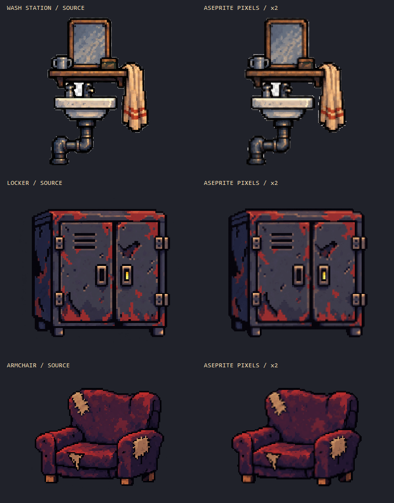

# 승인 원화 3종 → Aseprite 픽셀 전환 시험

**최신 픽셀 크기 비교:** [현재 / 2배 / 3배 / 4배](pixel-pitch-234-r1/README.md). 사용자가 차이를 더 크게 요청해 만든 선택 전 후보이며, 원본색·대비 설정과 승인본은 유지한다.

**픽셀 크기 선택용 추가 비교:** [현재 승인본 / A 1.25배 / B 1.5배 / C 2배](pixel-pitch-r2/README.md). 승인된 색·경계 처리 설정을 유지하고 격자 크기만 바꾼 9개 후보다. 사용자 선택 전이며 아래 승인 기준은 바꾸지 않는다.

**최신 승인본: [crisp-final-r1 — 평균 축소 없는 경계 보존 재제작](crisp-final-r1/README.md).** 원본 크기를 유지한 Aseprite 3종과 PNG, 원본/이전/새 결과 비교 및 검사를 포함한다. 2026-09-20 사용자가 원화 보존과 선명도를 승인하고 프로세스 재사용을 요청했다. 게임 반입은 별도 대기다.

**이하 과거 시험 기록:** `final-r1`의 평균 축소와 [선명도·명암 A/B 강조안](contrast-r1/README.md)은 사용자 피드백에서 경계 둔화가 확인되어 기본 방식으로 채택하지 않는다. 대비 강화로 공간 정보 손실을 복원할 수 없었다. 기존 파일은 비교용으로 보존했다.

2026-09-20. 사용자가 지정한 세 PNG를 **직접 입력**으로 사용했다. 새 이미지 생성, 디자인 재해석, 고정 도형으로 재제작하지 않았다. 아래 `final-r1/`은 이전 제출본이다. 게임에는 반입하지 않았고 지정된 세 원본의 SHA256이 그대로임을 확인했다.

## 결과 원본

| 대상 | 원본 PNG 크기 | 네이티브 캔버스 | 불투명 색 수 | 편집 원본 / PNG |
|---|---:|---:|---:|---|
| 세면대 | 207×300 | 106×152 | 102 | [Aseprite](final-r1/crew_wash_station.aseprite) · [PNG](final-r1/crew_wash_station.png) |
| 캐비닛 | 370×315 | 187×160 | 95 | [Aseprite](final-r1/workshop_locker_game_scale.aseprite) · [PNG](final-r1/workshop_locker_game_scale.png) |
| 의자 | 286×240 | 145×122 | 96 | [Aseprite](final-r1/workshop_armchair_game_scale.aseprite) · [PNG](final-r1/workshop_armchair_game_scale.png) |

네이티브 한 픽셀은 **입력 원본의 2×2 영역**에 대응한다. 모든 면에 투명 여백 1px을 추가했다. 좌표 대응은 `floor(sourceCoordinate / 2) + 1`이며 짝수가 아닌 끝 부분은 남은 실제 픽셀만 계산한다. 2배 Nearest 미리보기는 거의 원본 표시 크기다. 이 `2`는 이번 원본의 샘플링 간격이지 게임의 4px 규격을 변경했다는 뜻이 아니다.



## 실제 작업 방식

1. 원본을 `r2/sources/`에 동결 복사하고 경로·해시를 기록했다. 원본 전체가 대상이며 임의 크롭/부품 삭제를 하지 않았다.
2. Aseprite Lua에서 원본 RGBA를 직접 읽었다. 셀별 유효 색을 계산하고 알파 면적을 판정해 네이티브 격자에 배치했다. 원본의 반투명 외곽은 알파 128 기준으로 분류하고, 셀의 절반 이상이 전경이면 남기는 방식이다. 반투명 RGB를 검은색 배경과 합성한 뒤 추출하지 않는다.
3. 원본에서 가중 색 분할 및 반복 색 군집 계산으로 팔레트를 만들었다. 외부 웜그레이 팔레트를 강제로 적용하지 않았다. 디더링·무작위 점·블러를 추가하지 않았다. 색 수 96은 이번 후보 비교의 선택값이며 프로젝트의 새 상한이 아니다.
4. 4px/96색, 2px/64색, 2px/96색 후보를 원본 표시 크기로 비교했다. 4px는 거울 반사·수건 줄·의자의 해진 가장자리와 손잡이 주변 손실이 커 제외했다. 2px/96색을 최종 기반으로 골랐다. [세면대 후보](r2/review/crew_wash_station-candidates.png), [캐비닛 후보](r2/review/workshop_locker_game_scale-candidates.png), [의자 후보](r2/review/workshop_armchair_game_scale-candidates.png).
5. 평균 대신 셀 안의 실제 대표색을 고르는 추가 실험(`grid2-refined`)도 열어 보았으나 경계 잡점이 늘어 **채택하지 않았다**. 최종 제출본에는 이 실험의 전역 처리를 사용하지 않는다.
6. 세면대 선반 위 작은 녹색 소품이 갈색으로 치우치는 것을 발견했다. 해당 원본 영역에서 빠진 녹색 계열 6색을 보존해 **20개 네이티브 픽셀을 국소 색 보정**했다. 다른 두 프랍은 검토 후 의미 없는 추가 덧칠을 하지 않았다.
7. `.aseprite`를 저장하고 다시 열어 PNG를 내보낸 뒤 RGBA 전 픽셀 일치, 레이어·프레임·치수·이진 알파·투명 여백을 검사했다.

원본 레이어는 `source_mapped_pixels`, 국소 수정은 `pixel_cleanup`이다. 세면대만 국소 보정이 있으며 나머지 두 파일의 보정 레이어는 비어 있다. 모든 점을 손으로 다시 그린 작업이라고 주장하지 않는다. **원본 기반 변환 + 시각 검토 + 필요한 국소 보정**을 Aseprite에서 수행한 시험이다.

## 보존 검토와 남은 손실

- 세면대: 거울 프레임/반사, 컵, 소품, 선반, 수도꼭지, 세면기, 수건의 접힘과 붉은 줄, 굽은 배수관을 유지했다. 얇은 외곽과 미세 반사 패턴은 원본과 다르며 원본 1px짜리 작은 틈/잡점 일부는 사라졌다. 세 프랍 중 색·경계 손실이 가장 눈에 띈다.
- 캐비닛: 앞·옆면 비율, 두 문, 환기 슬롯, 경첩, 두 손잡이, 노란 강조색, 녹과 벗겨진 도장 패턴을 유지했다. 1px 경계 위치와 작은 녹 조각 일부가 달라졌다.
- 의자: 자주색 천, 붉은 명암 면, 등받이와 두 팔걸이, 세 곳의 찢어진 천/충전재, 다리를 유지했다. 보풀과 찢어진 가장자리의 가장 작은 돌출부는 일부 합쳐졌다.

개별 원본/결과 비교: [세면대](final-r1/review/crew_wash_station-before-after.png), [캐비닛](final-r1/review/workshop_locker_game_scale-before-after.png), [의자](final-r1/review/workshop_armchair_game_scale-before-after.png). 부분 확대: [수건·소품](final-r1/review/crew_wash_station-detail.png), [문·손잡이](final-r1/review/workshop_locker_game_scale-detail.png), [해진 팔걸이](final-r1/review/workshop_armchair_game_scale-detail.png).

규격과 원본 보존 해시: [verification.json](final-r1/verification.json). 실루엣 IoU는 원본 알파를 128로 이진화한 뒤 원본 영역에서 후보를 2배 복원해 겹친 비율이다. 색 오차는 두 마스크가 겹치는 영역의 RGB 채널 평균 절댓값이다. **어느 것도 그림체/디테일 보존율 또는 사용자 승인 점수가 아니다.**

## 게임 적용은 미실행

이번 결과를 현행 ×4 반입 도구에 그대로 넣으면 원본 대비 물체 크기가 약 2배가 된다. 따라서 원본/기존 런타임은 교체하지 않았다. 지금 결과는 원화 보존 방식과 해상도를 검토하기 위한 후보이며, 같은 게임 크기로 넣으려면 출력 배율·픽셀 밀도·카메라/기존 자산 혼용 정책을 별도 합의해야 한다. 실제 엔진의 조명·줌 검수도 미실행이다.

## 재현

저장소 루트에서 실행한다. `r2/sources/`는 이 시험의 동결 원본이다.

```powershell
& Tools/Aseprite/finish_approved_prop_trial.ps1 -RunName final-r1-repro
```

출력 폴더가 이미 있으면 중단한다. `r1/`은 진단 JSON 포맷 오류로 중단된 첫 시도, `r2/`는 후보 비교, `final-r1/`은 선택·보정한 제출본이다. 이전 결과는 덮어쓰지 않았다. 재현 실행도 게임 자산을 변경하지 않는다.
