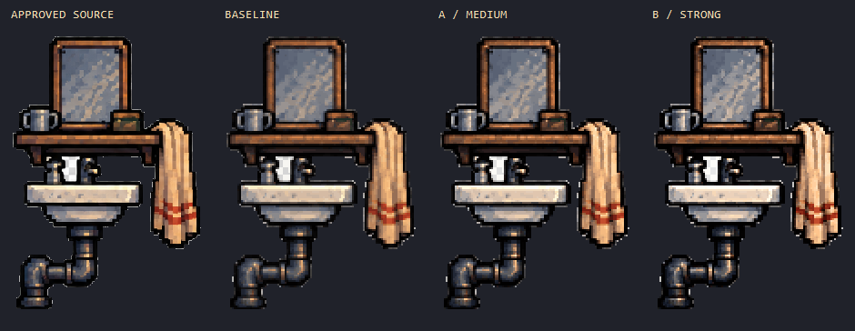
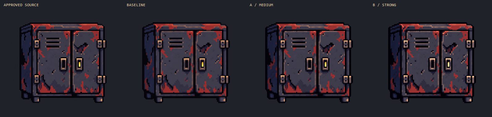
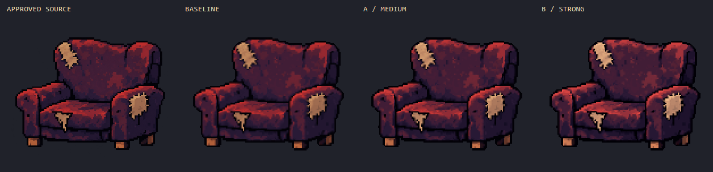

# 선명도·명암 대비 A/B 비교

세 프랍 각각에 A(중간 강조), B(강한 강조)를 추가했다. 두 가지 모두 `final-r1` 변환본의 **크기와 알파/실루엣이 완전히 동일**하다. 원본과 이전 Aseprite/PNG는 수정하지 않았고 게임에 반입하지 않았다. 사용자 선택 전의 비교 시안이다.

## 비교 순서

왼쪽부터 **승인 원본 / 기존 변환본 / A 중간 강조 / B 강한 강조**. 후보들은 네이티브 PNG의 정수 2배 확대이며 원본과 거의 같은 표시 크기다. 자동 맞춤 축소 없이 이미지 원래 크기로 보면 작은 명암 차이를 더 정확하게 비교할 수 있다.

부분 확대: [세면기·수도꼭지](review/crew_wash_station-detail.png) · [손잡이·문](review/workshop_locker_game_scale-detail.png) · [해진 팔걸이](review/workshop_armchair_game_scale-detail.png). [전체 비교판](review/all-comparison.png).

## 처리 차이

| 항목 | A 중간 강조 | B 강한 강조 |
|---|---|---|
| 명암 곡선 지수 | 1.22 | 1.48 |
| 국소 대비 복원 계수 | 0.30 | 0.60 |
| 국소 명도 보정 상한(0–255 범위) | ±8 | ±14 |
| 인상 | 원래 톤을 비교적 유지하며 밝은 모서리·암부 분리 | 반사·천의 밝은 부분·깊은 틈을 더 강하게 분리 |

이 수치는 ‘대비 몇 퍼센트 증가’나 품질 점수가 아니라 구현 파라미터다. 프랍별 전경 명도 60분위수를 중심점으로 사용하고, 너무 낮거나 높은 중심점은 36–120으로 제한했다. 중심점 아래는 어둡게, 위는 밝게 조정하되 연속적인 곡선으로 극단의 뭉침을 줄였다.

국소 복원은 불투명 이웃 중 같은 밝기 방향을 지지하는 픽셀이 있는 부분에서만 수행했다. **복원량은 대응하는 원본 2×2 영역의 명도 범위 안으로 제한**하고, 그 후 요청한 명암 강조 곡선을 적용했다. 따라서 최종 강조 명도는 원본보다 강할 수 있다. 원본 범위 안에 머무른다는 조건은 복원 단계에만 해당한다.

밝기 변경 시 RGB 색상 방향을 유지하고 색역을 벗어날 때만 채도를 줄였다. 기존 색에서 유도한 강조 팔레트로 다시 매핑하여, 국소 연산 때문에 수천 개의 미세한 새 색이 생기는 것을 막았다. 색감이 완전히 불변인 것은 아니며, 특히 B의 밝은 색은 옅어질 수 있다. 블러·무작위 점·디더링·외곽 글로우는 추가하지 않았다.

## 확인한 차이와 주의점

- 세면대: A/B에서 세면기 상단·수도꼭지·컵 반사가 강화됐다. B는 밝은 면의 미세 명암 차이가 줄어들 수 있으므로 원본과 비교해 선택한다.
- 캐비닛: 힌지·손잡이·환기 슬롯 경계와 녹의 대비가 강화됐다. 넓은 문 면과 부품 위치는 그대로다.
- 의자: 천의 붉은 밝은 면과 어두운 접합부가 분리되고 노출된 충전재가 더 밝아졌다. B는 원본보다 밝고 강한 인상이다.
- 이 두 버전은 요청에 따른 의도적인 강조안이다. 원화에 더 충실한지/강조가 좋은지는 사용자가 비교해 선택한다. 강조만으로 이미 없어진 세부 구조가 복구되는 것은 아니다.

## Aseprite / PNG

| 프랍 | A 중간 | B 강한 |
|---|---|---|
| 세면대 | [Aseprite](medium/crew_wash_station.aseprite) · [PNG](medium/crew_wash_station.png) | [Aseprite](strong/crew_wash_station.aseprite) · [PNG](strong/crew_wash_station.png) |
| 캐비닛 | [Aseprite](medium/workshop_locker_game_scale.aseprite) · [PNG](medium/workshop_locker_game_scale.png) | [Aseprite](strong/workshop_locker_game_scale.aseprite) · [PNG](strong/workshop_locker_game_scale.png) |
| 의자 | [Aseprite](medium/workshop_armchair_game_scale.aseprite) · [PNG](medium/workshop_armchair_game_scale.png) | [Aseprite](strong/workshop_armchair_game_scale.aseprite) · [PNG](strong/workshop_armchair_game_scale.png) |

기존 두 RGB 레이어를 유지하고 최상단에 `contrast_medium` 또는 `contrast_strong` 레이어를 추가했다. 해당 레이어를 끄면 기존 변환본으로 정확히 돌아간다. 6개 원본 모두 재열기·PNG 재출력 일치, 크기/알파 동일, 레이어를 끈 결과의 기존 PNG 일치를 검사했다. [파일별 검사·해시](verification.json).

재현: 저장소 루트에서 `Tools/Aseprite/build_prop_contrast_trials.ps1 -RunName contrast-repro` 실행. 이미 있는 폴더는 덮어쓰지 않는다. 현재 엔진의 ×4 반입에는 사용하지 않는다.
