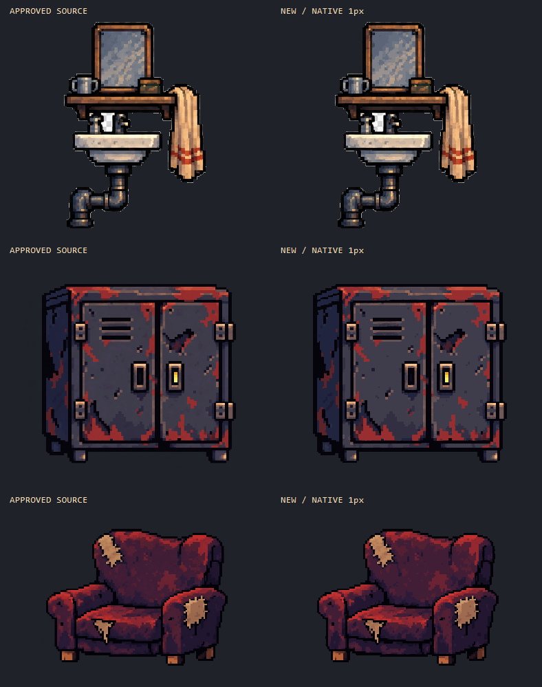

# 선명도 보존 재제작 — Aseprite 3종

2026-09-20. 원본의 경계가 무뎌지는 피드백을 반영해 **승인 원본에서 다시 제작**했다. 세 결과의 외관과 제작 프로세스는 사용자 승인되었다. 게임 반입은 하지 않았으며 원본과 과거 제출본도 변경하지 않았다.

## 사용자 승인 기록

아래는 이 버전의 승인 근거다. 현재 선택·승인 범위와 후속 이력은 [ART_ASSET_STATUS](../../../../Docs/ART_ASSET_STATUS.md)에서 관리하며 `verification.json`은 당시 검사 스냅샷으로 보존한다.

- 사용자 평가: “이번에는 정말 거의 90% 이상 보존되었고, 선명도도 잘 보존되었어.” 이어 “이번 프로세스를 잘 기억해줘”라고 요청했다.
- 위 90% 표현은 사용자의 시각적 평가다. 자동 검사 수치나 범용 보존율 보증으로 바꾸지 않는다.
- 승인 대상: 이 폴더의 세면대·캐비닛·의자 결과와 원본 보존형 경계 정리 프로세스. 파일 해시는 `verification.json`에 고정되어 있다.
- 재사용 설정: `Tolerance=12`, `Snap=20`, `Coherent=true`, `Passes=3`. 원본 해상도 유지 우선, 공간 평균 금지, 원본색 선택, 제한적 색 군집/경계 정리, 직접 비교와 재출력 검사를 함께 재사용한다.
- 이후 신규 결과는 개별 검수가 필요하다. 이번 승인은 게임 반입, 엔진 배율 변경, 기존 런타임 파일 교체 허가를 포함하지 않는다.

## 파일

| 대상 | 승인 원본 크기 | 새 네이티브 캔버스 | 출력 불투명 색 수 | 파일 |
|---|---:|---:|---:|---|
| 세면대 | 207×300 | 209×302 | 367 | [Aseprite](crew_wash_station.aseprite) · [PNG](crew_wash_station.png) |
| 캐비닛 | 370×315 | 372×317 | 148 | [Aseprite](workshop_locker_game_scale.aseprite) · [PNG](workshop_locker_game_scale.png) |
| 의자 | 286×240 | 288×242 | 82 | [Aseprite](workshop_armchair_game_scale.aseprite) · [PNG](workshop_armchair_game_scale.png) |

차이 2px는 네 면의 1px 투명 여백이다. 원본 좌표 `(x,y)`는 새 캔버스 `(x+1,y+1)`에 대응한다. 원본 1px = 제작 1px이며 축소/확대하지 않았다. 이전 2px 격자보다 더 큰 네이티브 해상도를 선택한 것이므로 같은 픽셀 예산에서 품질이 좋아졌다고 주장하지 않는다.



## 무엇을 바꿨나

- `2×2 평균 → 96색 축소 → 대비 강화`를 제거했다. 원본에서 각 픽셀의 색과 위치를 읽는다.
- 평균 RGB 대신 원본에 실제로 있는 색으로 팔레트를 구성했다. 원본과 채널 차이 12, 명도 차이 6.6 이내에서 유사색을 묶으며 공통 색 수 상한을 두지 않는다.
- 색 경계를 흐리는 블러 대신 주변 색 라벨 중 하나를 선택하는 제한적 군집 정리 3회를 사용했다. 원본과의 오차 한도를 계속 적용한다.
- 경계 양쪽에 연속된 색이 있고 방향이 명확한 경우에만 원본의 한쪽 색을 선택한다. 원본에서 계산한 명도 이동은 최대 20이고, 최종 경계색 묶기 오차는 명도 3 이내다. 이 한계는 모든 RGB 채널 변화가 20 이하라는 뜻은 아니다.
- 새 전역 대비 곡선, 임의 하이라이트, 외곽선 추가, 디자인 재해석은 없다. PNG를 단순히 Aseprite 파일로 포장한 것이 아니라 최종 격자의 색 군집과 경계 픽셀을 변경했다. 모든 점을 손으로 다시 그린 작업이라고 주장하지 않는다.

### Aseprite 레이어

1. `source_reference`: 숨겨진 승인 원본. 원본 반투명 값까지 보존한다.
2. `native_color_clusters`: 원본 위치에 대응하는 이진 알파 픽셀과 정리된 색면.
3. `edge_side_cleanup`: 원본 양쪽 색에 근거한 국소 경계 변경. 끄면 경계 정리 전 색 군집 결과가 보인다.

RGB 문서, 단일 프레임. 최종 출력색 전체를 Aseprite 팔레트에도 등록했다. 숨김 참조 레이어를 켜거나 다른 레이어를 끄면 최종 PNG와 달라지는 것은 정상이다.

## 비교와 시각 검토

각 확대판은 **원본 / 이전 평균 축소본 / 새 결과** 순서다. 이미지 내부는 정수배 Nearest만 사용했다. 브라우저나 뷰어가 이미지 전체를 비정수 비율로 줄이면 다시 흐려 보일 수 있으므로 원본 크기 또는 정수배로 확인한다.

- [세면대 경계](review/crew_wash_station-edge-comparison.png): 밝은 세면기 테두리, 검은 받침 틈, 배관 접합부의 얇은 명암이 이전본보다 유지된다. 거울 반사·수건 줄·작은 녹색 소품도 [전체](review/crew_wash_station-comparison.png)와 [수건 확대](review/crew_wash_station-detail.png)에서 확인했다.
- [캐비닛 경계](review/workshop_locker_game_scale-edge-comparison.png): 손잡이의 검은 내부, 상단 반사광, 두 문 사이의 세로 틈을 보존한다. 문·경첩·환기 슬롯·녹 패치의 위치는 [전체](review/workshop_locker_game_scale-comparison.png)에서 확인했다.
- [의자 경계](review/workshop_armchair_game_scale-edge-comparison.png): 충전재와 천의 맞닿는 경계, 가는 찢김, 팔걸이의 붉은 띠가 이전본보다 명확하다. 세 군데 찢김·등받이·좌석·다리는 [전체](review/workshop_armchair_game_scale-comparison.png)에서 확인했다.

중간 시험 `../crisp-r1/`은 원본 색을 너무 개별적으로 경계에 복사해 잡점이 늘어 제외했다. `../crisp-r2/`에서 경계색을 제한적으로 묶고, `../crisp-r3/`에서 비슷한 색의 흩어진 점을 더 정리했다. 이 제출본은 r3 이미지와 동일하며 참조/팔레트/검사를 정리한 버전이다.

## 검증

[verification.json](verification.json)에 입력/출력/생성기 해시와 검사 결과를 기록했다.

- 3종 모두 Aseprite 재열기 후 PNG RGBA 전 픽셀 일치.
- `../crisp-final-r1-repro/`에 새 기본값으로 독립 재실행했고 3종 모두 제출본과 RGBA 전 픽셀 일치. r3 후보와 제출본 이미지의 전 픽셀 일치도 확인했다.
- 원본 크기 + 투명 여백, RGB/1프레임/3레이어 및 숨김 원본 일치 검사 통과.
- 출력 알파 0/255, 투명 여백, 원본 알파 128 기준의 실루엣 완전 일치.
- 출력색 중 승인 원본에 없는 RGB는 0개. 원본 및 동결 복사본 SHA256 유지.
- 같은 원본 좌표의 강한 내부 경계 대비 유지 지표: 세면대 0.46770→0.96663, 캐비닛 0.42953→0.96735, 의자 0.44840→0.97098.

마지막 지표는 원본의 수평/수직 이웃 중 양쪽 알파≥128, 명도차≥24인 쌍만 선택해 출력의 동일 위치·동일 방향 대비를 원본 대비로 나누고 0~1로 제한한 평균이다. 대비 증폭으로 1을 초과해 점수를 얻을 수 없다. **얇은 경계 손실을 보는 보조 지표이며 전체 품질 점수/디테일 보존율이 아니다.** 공간 해상도가 높아진 효과도 포함한다. 모든 부위가 더 좋아졌다는 증명으로 쓰지 않는다.

## 남은 차이와 적용 제한

원본의 미세한 색 변화는 묶였고, 경계의 중간 전이색 일부는 한쪽 색으로 바뀌었다. 세면대의 넓은 재질 면에는 작은 색 클러스터가 여전히 있다. 완전 무손실 복사나 모든 미세 질감의 동일 보존은 아니다. 숨김 참조와 동일 좌표 확대판으로 계속 대조할 수 있다.

기존 게임의 Native4와 다른 제작 해상도다. 현재 ×4 반입 도구로 그대로 넣으면 물체 크기가 원본 대비 약 4배가 된다. 원본을 지키기 위해 고른 시안 해상도이며, 월드 크기·혼합 픽셀 밀도·카메라 정책 합의와 엔진 검수 전에는 게임 리소스를 교체하지 않는다. 원화 승인과 이번 결과 승인은 구분한다.

## 재현

저장소 루트에서:

```powershell
powershell.exe -NoProfile -ExecutionPolicy Bypass -File Tools/Aseprite/build_crisp_prop_trial.ps1 -RunName crisp-final-r1-repro
```

출력 폴더가 있으면 중단한다. `r2/sources/` 동결 원본을 읽고 GameReady 원본 해시가 일치하는지도 확인한다. 결과 파일을 직접 수정했다면 수정본은 별도 버전으로 보존하고 그 Aseprite에서 내보낸다.
