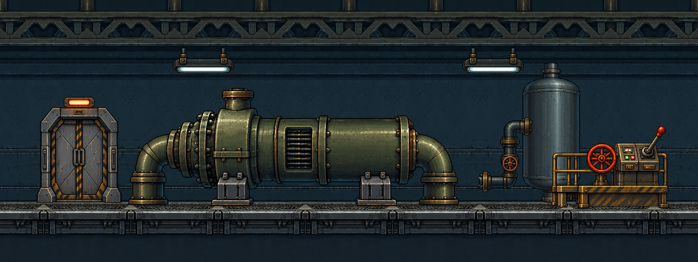

# 냉각 펌프 정비실 — 반복 배경·독립 프랍 팩 v1

사용자가 지정한 [첫 원화](Source/concept_v1.png)를 기준으로 만든 **배경 자산 시안**이다. 원화의 펌프·탱크·콘솔·문·밸브·등기구를 독립 배치할 수 있고, 비운 벽·천장·바닥을 좌우로 반복해 방 길이를 늘릴 수 있다. 원본은 보존했다.

## 파일과 조립

| 자산 | 파일 | 크기·사용 |
|---|---|---|
| 반복 배경 아틀라스 | `Background/background_repeat_2x6_128.png` | 256×768, 128×128 셀 2열×6행. 열 0→1을 한 세트로 좌우 반복 |
| 개별 배경 셀 | `Background/bg_r{0..5}_c{0..1}.png` | 각각 128×128. 아틀라스를 쓰지 않는 배치 도구용 |
| 벽 안쪽 채움 | `Background/wall_fill_repeat_128.png` | 128×128, X/Y 양방향 반복. 더 높은 방의 벽 안쪽에만 사용 |
| 투명 프랍 | `Props/*.png` | 펌프, 탱크, 콘솔, 닫힌 정면문, 벽 배관 밸브, 천장 등기구 6종 |

배경은 위에서부터 천장·상부 벽·중부 벽·하부 벽·바닥·기초의 **6행**으로 조립한다. 가로는 `[0, 1]` 열 쌍을 반복한다. 8쌍을 놓으면 2048×768 화면이 된다. [배경 반복 검수](Preview/background_repeat_8x.png)와 [다른 프랍 배치](Preview/recombined_example.png)를 함께 확인한다.

프랍 PNG는 알파가 투명하고 여백을 2px 남겼다. 펌프·탱크·콘솔·문은 **하단 중앙**, 밸브는 벽 배치 기준으로 **하단 중앙**, 천장 등은 **상단 중앙**을 피벗으로 삼는다. 약한 투영과 크기를 유지하려면 최근접 필터, 정수 좌표, 무손실 PNG를 사용한다. 접지선은 이 팩의 768px 배경에서 위쪽 기준 대략 **Y=608px**다. 충돌과 상호작용 범위는 이미지 알파에서 자동 생성하지 말고 게임 규칙에 맞게 별도 설정한다.

Godot 예시: [CoolantPumpRoomAssetPreview.tscn](../../../../GodotPrototype/scenes/CoolantPumpRoomAssetPreview.tscn)과 [coolant_pump_room_pack.gd](../../../../GodotPrototype/scripts/coolant_pump_room_pack.gd). `repeat_pairs`로 방 길이를 늘리고 `add_prop`, `move_prop`, `set_prop_visible`로 프랍을 별도 배치한다. PNG는 `GodotPrototype/assets/coolant_pump_room/`에도 복사해 두었다. 프로젝트 씬에 자동 반입하지 않았다.

## 원화와 다른 부분

- `Source/empty_plate_generated.png`는 펌프 등의 가려진 면을 원화를 참고해 **추정 복원한 이미지**다. 원화에서 그대로 드러난 픽셀이 아니다.
- 투명 프랍은 원화에서 분리하면서 보이지 않던 테두리·배관 끝을 보완했다. 특히 탱크와 문은 독립 배치에 맞춰 뒷면을 완성했으므로 원화의 정확한 픽셀 복제본은 아니다.
- 배경 반복 단위는 원화 배경판의 128px 폭 부분을 좌우 대칭으로 이어 붙였다. **좌우 이음새 픽셀은 일치**하지만, 긴 빈 벽을 연속해서 쓰면 무늬가 반복돼 보인다. 큰 설비와 벽 프랍을 서로 다른 위치에 배치해 리듬을 끊는다.
- 이 팩은 원화의 색과 디테일을 보존한 시안이다. 앞선 32색 실험본을 이 원화에 강제로 적용하지 않았다. 픽셀 피치와 캐릭터·카메라 상대 크기는 [규격 정립 계획](../../../../Docs/SCALE_STANDARDIZATION_PLAN.md)의 플레이 검수가 남아 있다.

재생성: `Tools/BackgroundAssetization/build_coolant_pump_pack.ps1 -Build`. 생성과 분리에는 이미지 생성 도구를 사용했고, 스크립트는 투명 여백 정리·최근접 크기 조정·128px 셀 분할·정확한 좌우 반복 검사를 수행한다. 현재 검증은 PNG 조립 미리보기와 이음새 검사까지이며, 이 환경에서는 Godot 실행 파일을 찾지 못해 실제 엔진 렌더는 아직 확인하지 못했다.
