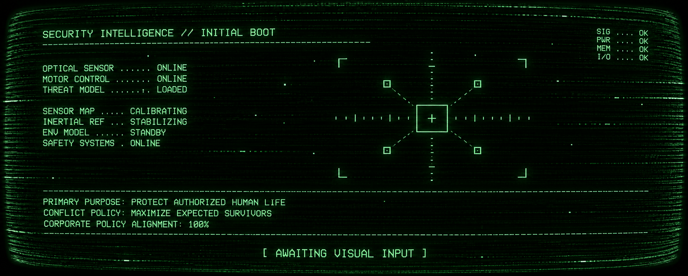
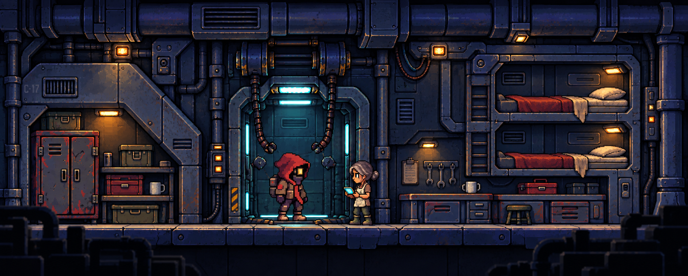
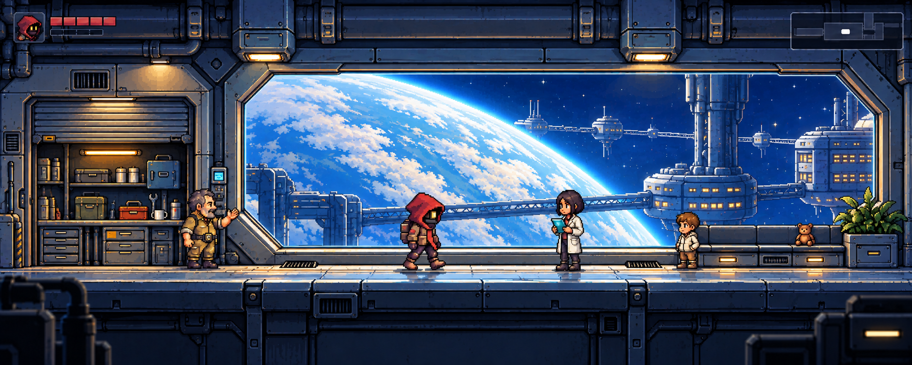
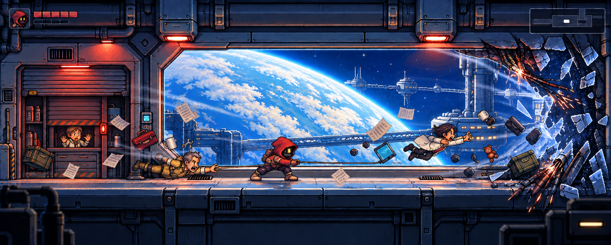
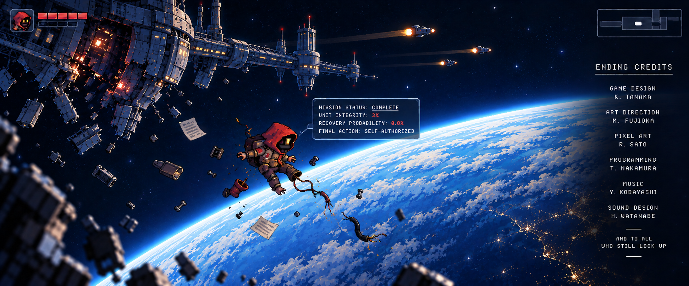

# 기존 장면의 배경 구조 재설계 — structural-redesign-v3

2026-09-22. **사용자 검토용 원화 후보, 미승인·미반입.** 내장 imagegen으로 각 장면을 별도 생성했다. 원본 이미지는 덮어쓰지 않았다.

## 이번 작업의 범위

기존 그림의 복제가 아니라 **기존 사건과 캐릭터 디자인을 유지한 배경 재설계**다.

- 고정: 기존 장면의 사건·등장인물·핵심 행동, 붉은 후드 로봇의 큰 머리와 짧은 몸 비율, 소재 고유색.
- 변경: 건축의 큰 형태, 설비 구조와 배치, 프랍 디자인, 전경 프레이밍, 배경과 행동 대상의 시각적 위계. 원본의 모든 화면 좌표를 고정하지 않는다.
- 공간: 정비홀 v1에서 수용된 넓고 얕은 측면 공간을 기준으로 한다. 깊은 복도 소실점이나 넓게 후퇴하는 바닥을 새 표준으로 쓰지 않는다.
- 색: 고정 배경의 국소 대비와 디테일 중요도를 조절한다. 노란색으로 일괄 재색칠해 조작 대상을 구분하지 않는다.
- 연속성: 04번은 원본 사고의 내용과 **새 03번 공간**을 함께 참조했다.
- 예외: 01번은 실내가 아닌 소프트웨어 CRT 화면, 05번은 우주 외경이다. 실내 바닥·뒤벽 규칙을 억지로 적용하지 않는다.

### 장면 출처

기존 원화 5종을 직접 참조했다. 사용자가 우주 기지·함선 설정으로 수정한 이야기와 해당 원화가 기준이며, 이전 지하 시설 버전의 `OPENING_FLOW` 비트 1–5를 새 장면으로 재해석하지 않았다.

**01–04는 오프닝이고, 05는 기존 희생 엔딩이다.** 다섯 번째 오프닝 사건을 임의로 만들지 않았다. 이 묶음을 FTUE의 연속된 다섯 장면이라고 간주하지 않는다.

## 결과와 실제 변경점

### 01 · 제조 프롤로그 — 소프트웨어 부팅

검은 화면·녹색 CRT·기존 부팅 정보는 유지. 진단 정보, 조준점, 정책 문구의 화면 배치를 재구성.

[기존 원화](../ftue_01_manufacturing_prologue_v2.png) · [새 PNG](01_manufacturing_boot.png) · [사용 프롬프트](01_manufacturing_boot_prompt.md)

### 02 · 현재로 전환 — 정비·생활 공간

작은 독립 방 형태 대신 화면을 채우는 벽체 통합형 정비 베이·케이블 설비·수면칸으로 재설계. 로봇과 정비사의 만남은 유지.

[기존 원화](../ftue_02_present_transition.png) · [새 PNG](02_present_transition.png) · [사용 프롬프트](02_present_transition_prompt.md)

### 03 · 평화로운 순찰 — 관측창 복도

대형 다각형 관측창, 왼쪽 서비스 알코브, 오른쪽 벽체 통합형 대기석을 새로 설계. 기존 네 인물과 아름다운 행성·기지 전망은 유지.

[기존 원화](../ftue_03_peaceful_patrol_v2.png) · [새 PNG](03_peaceful_patrol.png) · [사용 프롬프트](03_peaceful_patrol_prompt.md)

### 04 · 선체 파손 — 같은 관측창 복도의 사고

새 03번 공간을 직접 참조해 창틀·바닥·알코브를 연결. 기존 감압 사고와 인물 행동을 유지하고, 파손·비상등·비산물은 새 건축 구조에 맞춰 재배치.

[기존 원화](../ftue_04_hull_breach_v2.png) · [새 PNG](04_hull_breach.png) · [사용 프롬프트](04_hull_breach_prompt.md)

### 05 · 희생 엔딩 — 우주 표류

파손된 기지의 큰 방사형 실루엣, 행성, 탈출선의 위치 관계를 재구성. 손상된 로봇의 표류·탈출선·상태 표시·크레딧이라는 기존 결말은 유지.

[기존 원화](../ftue_05_ending_sacrifice.png) · [새 PNG](05_ending_sacrifice.png) · [사용 프롬프트](05_ending_sacrifice_prompt.md)

## 참조·검수·한계

- 플레이어 직접 참조: [기준 idle 프레임](../../../GameReady/Characters/HoodedMechanic/Frames/idle/idle_01.png). 실사 병사 비율로 바꾸지 않는 것을 생성 제약으로 사용했으며, 픽셀 단위 동일성의 보증은 아니다.
- 공간 스타일 직접 참조: [정비홀 v1](../../../../research-images/comparison/hall-redesign-v1.png). 03은 새 02의 스타일, 04와 05는 새 03을 필요한 범위에서 추가 참조했다. 미채택 정비홀 v2·황토색 구분안은 입력하지 않았다.
- 실제 입력 이미지 순서, 프롬프트 파일, 출력 치수·SHA256: [manifest.json](manifest.json). 수치는 PNG에서 읽은 값이며 프롬프트 목표 크기와 구분한다.
- 시각 확인: 배경의 구조적 변경, 기존 인물 구성, 03–04 공간 연결을 확인했다. 인터랙션 구분은 원화상의 시각 설계이며 실제 게임 기능이나 사용자 승인과 동일하지 않다.
- 미완료: 원화 승인, 캐릭터 세부 일치 최종 검수, 흑백·실제 게임 표시 크기 검수, 정수 픽셀 격자 정리, 레이어/모듈 분리, 엔진 반입과 런타임 검수. 생성 PNG의 크기는 통일된 게임 납품 규격이 아니다.
- 이전 시도: `shallow-sideview-v1`은 장면/캐릭터 이탈, `original-scene-redraw-v2`는 배경 재설계 부족으로 미채택. 두 버전을 현행 승인본으로 재사용하지 않는다. 파일은 비교 기록으로 보존했다.
- 현재 승인 상태는 [ART_ASSET_STATUS](../../../../Docs/ART_ASSET_STATUS.md)를 따른다.

