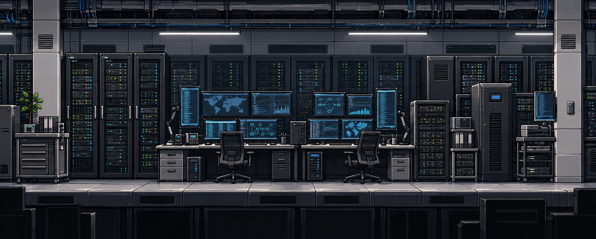

# 현대식 전산실 v2 — 신규 원화 시안

사용자가 v1을 “너무 오래된 스타일”로 판단해 현대식 재설계를 요청했다. 2026-09-23 내장 imagegen으로 v1을 참조해 새 원화 한 장을 생성했다. **사용자 검토 후보이며 미승인·게임 미반입**이다.

- 유지: 장비 밀집도, 청키 픽셀아트, 얕은 사이드뷰, 뒤 설비/앞 구조·바닥의 두 레이어 구상.
- 교체: CRT·테이프 드라이브·낡은 조작반 → 평판 모니터·서버 랙·현대식 워크스테이션. 녹슨 리벳 골조·철망 램프 → 깔끔한 패널·케이블 트레이·선형 LED.
- 기존 v1은 비교 기록으로 보존한다. 현대식 표현의 승인본으로 사용하지 않는다.

## 결과와 경계

곡면 CRT·테이프 릴·녹슨 리벳 골조 대신 평판 관제석, 서버 랙, 정돈된 배선 트레이·벽 패널·선형 조명을 사용했다. 장비가 많은 구성과 얕은 측면 바닥은 유지했다. 화면 전체를 같은 밝기의 파란색으로 채우지 않고 앞 관제석을 주요 가독 영역으로 두었다.

기존 v1 PNG와 게임 적용 자산은 변경하지 않았다. 이 파일은 합성 원화 한 장으로, 실제 레이어·타일·프랍 분리 또는 네이티브 픽셀 격자 검증이 끝난 리소스가 아니다. 상호작용 대상도 확정하지 않았다.

1978×795 PNG, 1,847,661 bytes. SHA256 `4f0849ea046e1f5c7785e0bed49675506b83889b255030f61c168ebe8b5459a3`.

입력 v1은 직접 수정할 원안으로 사용했다. [실제 생성 프롬프트](PROMPT.md)는 별도 기록했다. 2026-09-22의 첫 호출은 사용량 한도로 실패했으며, 이번 생성에서 성공했다.
