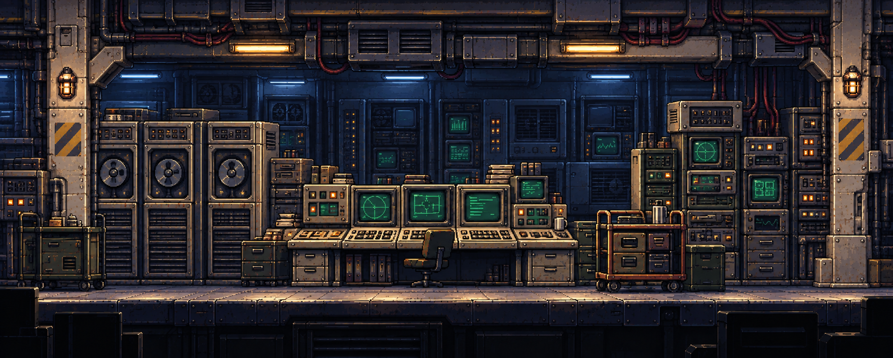

# 컴퓨터 장비 밀집 전산실 v1

2026-09-22. 사용자 요청에 따른 신규 원화 한 장. **사용자 검토 후보이며 미승인·미반입**이다. 내장 imagegen으로 생성했고 기존 이미지를 덮어쓰지 않았다.

## 디자인

왼쪽 테이프 드라이브/메인프레임, 중앙 CRT·키보드 콘솔, 오른쪽 적층 진단 장비와 카트, 뒤벽의 추가 컴퓨터 랙으로 장비 밀집 공간을 구성했다. 단순 모니터 벽 대신 서로 다른 기능과 크기의 장비 덩어리를 사용했다.

앞 설비는 낡은 아이보리·웜그레이·올리브 소재, 뒤 설비는 낮은 대비의 청회색으로 분리했다. 뒤쪽 화면의 밝기를 억제하고 앞 CRT를 상대적으로 읽기 쉽게 두어, 화면이 많아도 모두 같은 중요도로 빛나지 않게 했다. 얕은 바닥, 장비 겹침, 모니터/랙의 두께와 약한 측면 원근을 유지했다. 캐릭터·HUD는 넣지 않았다. 단말 조작 여부는 실제 게임 기능으로 확정하지 않았다.

## 후속 패럴랙스 분리 구상

1. **뒤판:** 뒤벽과 후면 컴퓨터 랙, 부착 배선·환기 설비·후면 조명.
2. **앞판:** 앞 메인프레임·CRT 콘솔·진단 장비·카트·의자, 앞 골조와 케이블 구조, 바닥 및 하단 트림.

정확히 두 움직임 그룹으로 묶는 구상이다. 현재 파일은 합성 PNG 한 장이며 실제 분리 리소스가 아니다. 승인 이후 가려진 면 복원, 연결 케이블의 소속과 그림자, 좌우 여유 폭 및 작은 상대 이동에서의 이음새를 확인해야 한다. 하단 암부는 별도 세 번째 층으로 분리하지 않는다.

## 참조와 검수

- [직전 A안](../two-layer-maintenance-v1/A_service_gallery.png): 그림체·스케일·두 깊이 그룹의 개발 참조. 사용자 승인본이라는 뜻은 아니다.
- [기존 통신실](../../Environments/retro_comm_control_room_concept_v1.png): CRT·키보드·물리 조작부 등 아날로그 장비 디자인 참조. 외부 검은 여백과 작은 방 구도는 채택하지 않았다.
- [프롬프트 전문](PROMPT.md). 두 입력은 수정 대상이 아닌 새 생성의 참조다.
- 완성 그림에서 장비의 밀집도, 앞뒤 명암 구분, 장비 간 가림, 좁은 수평 이동선, 캐릭터·HUD 부재를 직접 확인했다.
- 네이티브 픽셀 격자 정리, 레이어 분리·복원, 실제 패럴랙스 동작·런타임 검수는 미실행이다.

출력: `computer_equipment_room.png`, 1978×795, 2,229,485 bytes.
SHA256: `148f51c4909edd233431254486a31d2716d0188aeec5b4f69fdebb17a58974ad`.
생성 원본: `C:/Users/Loadcomplete/.codex/generated_images/01a0c792-3e77-7f32-b584-08f348b2cb36/exec-f5368d20-cfbf-4e90-834b-779dc6e23455.png`.
프로젝트 저장본과 생성 원본의 해시 일치를 확인했다.

