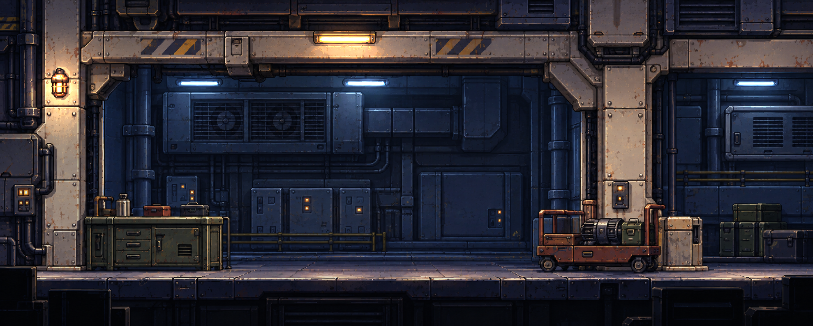

# A 벽체형 정비실 — 원화 보존형 타일·프랍 팩

사용자가 첨부한 1978×795 배경은 `two-layer-maintenance-v1/A_service_gallery.png`와 SHA256이 정확히 같다. 원본은 수정하지 않았다. 이 팩은 해당 원화를 **뒤판·앞판 타일, 독립 프랍, 독립 조명 프랍**으로 가공한 Godot 4.7.2 작업본이다. 배경 선정·가공 요청은 기록하되 최종 아트 승인이나 본 게임 장면 반입 승인을 추정하지 않는다.

## 자산 구조

| 용도 | 파일 | 성격 |
|---|---|---|
| 원화 재현 뒤판 | `GodotPrototype/assets/service_gallery/service_gallery_rear.tres`, `rear_atlas_128.png` | 128px 16×7 고유 셀. 벽·환기 설비의 원화 좌표 보존 |
| 원화 재현 앞판 | `.../service_gallery_front.tres`, `front_atlas_128.png` | 같은 크기의 앞 골조·기둥·바닥 셀. 뒤판과 합쳐 원래 구도 구성 |
| 확장 반복 타일 | `.../service_gallery_repeat.tres` | 벽 256×256, 천장 보·바닥 띠 각 256×128, 기둥 몸통 128×128. 각 128px 셀로 등록. 천장·바닥은 수평, 기둥은 수직 반복용 |
| 분리 프랍 | `.../props/` | 작업대, 모터 카트, 정비 캐비닛, 적재 상자 4개. 원화에서 잘라낸 투명 PNG |
| 가려진 면 보수 | `.../repair/` | 프랍을 숨기거나 옮길 때 원래 자리만 덮는 4개 패치. 평상시에는 숨김 |
| 조명 프랍 | `.../fixtures/`, `ServiceGalleryLightProp.tscn` | 원화의 등기구 외형 5개와 Godot `PointLight2D`를 결합. 빛 켜기/끄기 가능 |
| 조립 씬 | `GodotPrototype/scenes/ServiceGalleryPack.tscn` | 두 `TileMapLayer`, 네 프랍, 다섯 조명, 보수 패치를 배치 |
| 검토 씬 | `GodotPrototype/scenes/ServiceGalleryPreview.tscn` | 원화와 같은 1978×795 기준 카메라. 본 게임 씬에는 자동 반입하지 않음 |

고유 셀 112개씩은 **원화를 재조립하는 타일**이므로 임의 순서로 나열하면 자연스럽게 이어지는 범용 타일이 아니다. 방 길이를 확장할 때는 별도 반복 타일셋의 벽·천장·바닥·기둥 셀을 사용한다. 이 구분은 원화 보존과 반복 배치를 동시에 지원하기 위한 것이다. 반복 방향의 양 끝 픽셀은 채널 차이 0으로 검사했고 각 3×3 반복 미리보기를 남겼다.

## 조명과 프랍 사용

조명 다섯 개는 하우징·발광부 이미지만 잘라냈고, 넓은 조명 퍼짐은 `PointLight2D`가 엔진에서 만든다. 원화에 그려졌던 광원 영향은 주변 색을 추정해 완화했다. 완전한 역계산은 불가능하므로 바탕에 일부 조명 뉘앙스가 남아 있다. [켜짐](godot_lights_on.png) / [꺼짐](godot_lights_off.png) 실제 렌더를 비교할 수 있다. `ServiceGalleryPack.fixtures_on`으로 함께 전환할 수 있다.

원래 위치의 프랍은 보수 패치가 꺼져 있어 원화 재조립을 우선한다. `set_prop_visible(id, false)`는 해당 프랍을 숨기고 제자리 보수 패치를 켠다. `move_prop(id, local_position)`은 프랍을 옮기면서 원래 자리를 덮는다. `reset_prop(id)`는 원위치로 되돌린다. [카트 제거 실제 렌더](godot_cart_removed.png)로 결과를 확인한다. 원화에서 가려진 벽·기둥·바닥은 존재하지 않는 픽셀이므로 패치는 주변 원화로 추정 복원한 것이다. 새 위치나 빈 공간을 장시간 노출할 경우 이음새와 재질을 별도 아트 검수해야 한다.

앞판은 기본 위치 `front_shift_px = 0`이 원화 재현 기준이다. [12px 이동 스트레스 테스트](godot_front_shift_12px.png)도 남겼다. 이동량을 크게 쓰면 가려졌던 뒤판의 추정 복원부가 보일 수 있으므로 게임에서 원하는 이동 계수는 별도 결정한다.

## 재생성·검증

1. `Tools/BackgroundAssetization/build_service_gallery.py --build` — 원본 해시 확인, PNG·배치·미리보기·매니페스트 생성. Python Pillow·NumPy 필요.
2. Godot 편집기 `--headless --path GodotPrototype --import --quit` — 텍스처 가져오기.
3. Godot `--headless --path GodotPrototype --script res://tools/build_service_gallery_tilesets.gd` — 세 `.tres` 타일셋 저장.
4. Godot `--headless --path GodotPrototype --script res://tools/validate_service_gallery.gd` — 셀·프랍·복원·조명 노드·토글 검증.
5. GPU 렌더러에서 `--path GodotPrototype --script res://tools/render_service_gallery.gd --rendering-driver opengl3` — 실제 조명 켜짐/꺼짐·카트 제거·앞판 이동 이미지 생성. 자동 CRT 후처리는 이 비교에서만 숨긴다.
6. `Tools/BackgroundAssetization/verify_service_gallery.py` — 원본/첨부 해시, 셀 재조립, 투명 RGB, 반복 이음새, 렌더 조명 차이와 원화 MAE 기록.

[매니페스트](manifest.json) · [검증 결과](verification.json) · [원화/엔진 렌더 비교](source_vs_godot.png) · [원화/조립 비교](source_vs_diffuse.png) · [프랍 제거 시 복원 비교](props_removed_repaired_preview.png). MAE는 8비트 RGB의 평균 차이일 뿐 아트 승인율이나 실제 플레이 품질 점수가 아니다. 현재 Godot 조명 켠 렌더는 원화와 평균 채널 차이 7.238/255, 조명 끈 렌더는 7.744/255다. 원본과 가장 가까운 판단은 이미지들을 직접 비교해야 한다.
