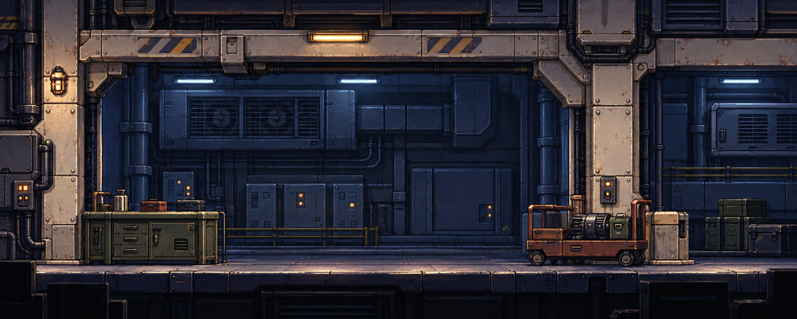
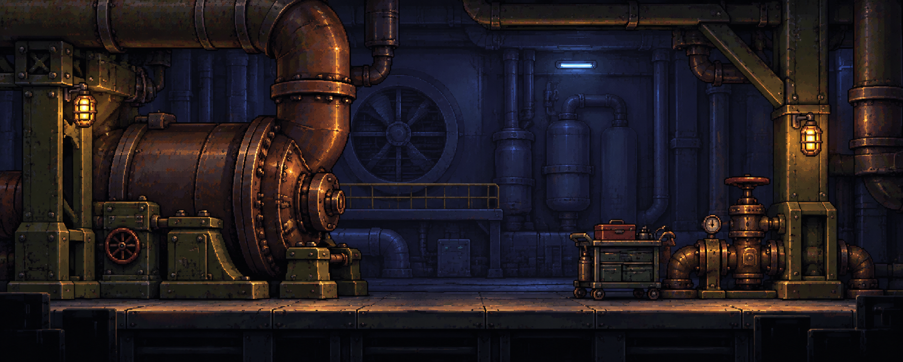

# 2레이어 패럴랙스 비교 원화 — 정비 구역 A/B

2026-09-22. 내장 imagegen으로 생성한 **두 장의 평면 합성 원화 후보**. 아직 선택·승인되지 않았으며, 리소스 분리·가려진 면 복원·픽셀화·게임 적용은 하지 않았다. 기존 원화와 런타임 자산은 변경하지 않았다.

## 범위와 공통 기준

사용자 요청은 평범한 배경 테마 한 가지를 서로 완전히 다른 느낌의 두 안으로 비교하는 것이다. 기존 정비실 계열을 선택했다. 두 안은 동일한 1978×795 크기이며, 캐릭터·HUD·새로운 사건 없이 배경만 비교한다.

[현재 배경 방향](../../../../Docs/BACKGROUND_ART_DIRECTION.md), [메탈슬러그 조사 기록](../../../../Docs/BACKGROUND_RESEARCH_LOG.md), ART_GUIDE §0–6과 현재 승인 상태를 확인했다. [정비홀 v1](../../../../research-images/comparison/hall-redesign-v1.png)을 그림체·크기 참조로, [MS X 실내 보존 이미지](../../../../research-images/metal-slugx-industrial.jpg)를 큰 형상·겹침 연구 참조로 직접 입력했다. 기존 구도나 메탈슬러그의 캐릭터·HUD를 복제하는 작업은 아니다.

깊은 복도나 넓은 원근 바닥 대신 두께, 앞뒤 차폐, 국소 명암 차이, 약한 측면·윗면으로 공간감을 설계했다. 배경 레이어의 색조 구분은 상호작용 여부의 확정이나 기존 프랍 재색칠과 다르다. 여기의 설비는 배경으로 제안했으며 실제 조작 기능은 미정이다.

## A — 벽체형 정비실

정돈된 수평 골조, 넓은 직사각형 개구부, 여유 있는 중앙 공간이 중심이다. 앞의 밝은 웜그레이 구조와 올리브 작업 설비가 뒤의 차분한 청회색 환기 설비를 가린다. 왼쪽 작업 캐비닛과 오른쪽 부품 운반대가 서로 다른 약한 측면을 보여준다.

- **뒤 레이어:** 청회색 벽체, 환기 팬/덕트, 벽 부착 배관과 캐비닛, 뒤쪽 난간 및 해당 조명.
- **앞 레이어:** 밝은 기둥·가로보와 부착 조명, 작업 캐비닛, 부품 운반대, 바닥·하단 단면·끝부분 암부 트림.
- 주 차폐 경계: 기둥 안쪽과 가로보 아래, 낮은 작업 설비의 윗윤곽. 이 경계 뒤로 후면 설비가 조금 움직이는 방향을 제안한다.

## B — 펌프 설비실

둥근 대형 펌프, 휘어진 배관, 비대칭 빈틈과 낮은 천장 인상이 중심이다. 구리·녹슨 갈색·탁한 올리브의 앞 설비와 작은 따뜻한 작업등을 차가운 남청색 뒤벽/탱크와 대비시켰다. A와 색만 다른 것이 아니라 큰 실루엣과 밀도·개방감이 다르다.

- **뒤 레이어:** 남청색 벽, 원형 환풍기, 압력 용기, 뒤쪽 설비 발판/난간과 배관, 후면 조명. 발판도 별도 중간 패럴랙스 층을 만들지 않고 뒤 레이어에 포함한다.
- **앞 레이어:** 큰 펌프와 상단 곡관, 지지대, 오른쪽 밸브·공구 카트, 부착 조명, 바닥·하단 트림.
- 주 차폐 경계: 펌프/곡관의 둥근 외곽과 오른쪽 지지대·밸브 주변. 비대칭 빈 공간으로 뒤 설비가 드러난다.

## 두 레이어로 가공할 때의 경계

두 안 모두 **뒤판 1장 + 앞 구조·바닥판 1장**이라는 동일한 분리 구상이다. 하단의 어두운 장식도 앞판에 합쳐 별도 세 번째 패럴랙스 레이어를 만들지 않는다. 캐릭터는 이번 배경 원화에 포함하지 않았다.

현재는 PNG 안에 실제 레이어가 들어 있지 않다. 사용자가 하나를 선택한 뒤 그 원화를 직접 기준으로 분리하고, 앞 구조에 가려진 뒤판 영역·좌우 여유 영역을 복원해야 한다. 이때 원화의 형태·재질·색·비율을 보존하며, 레이어를 가로지르는 연결부와 그림자는 추가 확인한다. 이동 계수나 엔진 설정은 지금 확정하지 않았다.

## 검수와 산출물

생성 결과 두 장을 직접 보고 다음을 확인했다.

- 동일한 일상 정비 테마와 프로젝트의 금속·청키 픽셀 원화 계열.
- A의 직선적 개방감과 B의 둥글고 밀집된 설비 공간이 구분됨.
- 앞 구조/프랍이 뒤 설비를 가리는 경계와 냉·온/명암 차이가 존재함.
- 좁고 연속된 수평 이동 바닥이 남고 중앙 원근 터널을 사용하지 않음.
- 캐릭터·HUD·장면 설명 글자가 없음.
- 두 움직임 그룹으로 배정할 수 있는 구도. 실제 절단·복원·가동 검수는 미실행이므로 완성된 패럴랙스 리소스라고 부르지 않음.

[정확한 프롬프트](PROMPTS.md) · [파일·입력·해시 기록](manifest.json). 파일 크기/해시 확인은 아트 승인이나 엔진 호환성 검증을 대신하지 않는다. 원화 후보 제작은 완료했으며, 후속 분리 가공은 사용자 선택 이후의 별도 단계다.

