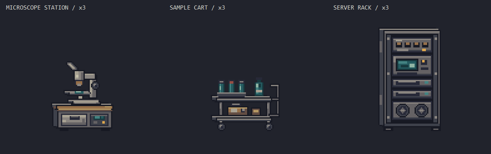

# 연구시설 추가 프랍 3종

> **현재 상태: 미채택 실험 기록.** 아래 r4는 구조 교정 시험의 마지막 버전일 뿐 승인 원화의 보존형 픽셀화 결과가 아니다. 사용자는 여전히 기존 프랍과 톤이 다르다고 지적했으며 채택하지 않았다. 새 제작은 [ART_GUIDE §0](../../../../Docs/ART_GUIDE.md)의 원화 보존 원칙을 따른다. 아래 수치·절차·‘최신 후보’ 표현은 당시 기록이다.

2026-09-20. 최신 교정 후보는 **r4/**다. 사용자 피드백에 따라 r3의 일그러진 형태를 덧칠하지 않고 구조부터 다시 그렸다. 16색 역할 팔레트 안에서 네이티브 좌표로 Aseprite Lua 제작; 이미지 생성 모델이나 고해상도 축소를 사용하지 않았다. 상위 폴더의 r3(이전 3종)와 구분한다. r1/r2/r3는 비교용으로 보존했다.

| 프랍 | 네이티브 | 월드 ×4 | 사용 색 | 원본 |
|---|---:|---:|---:|---|
| 현미경 작업대 | 55×59 | 220×236 | 15 | [Aseprite](r4/microscope_station.aseprite) · [PNG](r4/microscope_station.png) |
| 이동식 시약 카트 | 63×48 | 252×192 | 14 | [Aseprite](r4/sample_cart.aseprite) · [PNG](r4/sample_cart.png) |
| 서버 랙 | 61×88 | 244×352 | 12 | [Aseprite](r4/server_rack.aseprite) · [PNG](r4/server_rack.png) |

세 최종 원본 모두 `shadow / structure / material / functionals / finish`의 편집 레이어 5개, 정지 프레임 1개다. 부분 알파 0, 불투명 경계 0, Aseprite 재출력 PNG와 납품 PNG의 RGBA 전 픽셀 일치 검사를 통과했다. 결과와 해시는 [verification.json](review-r4/verification.json). 월드 ×4는 환산 규격이며 이번에는 런타임 PNG를 교체하지 않았다.

## r4: 형태를 먼저 교정

| 대상 | r3에서 드러난 결함 | r4에서 고정한 구조 |
|---|---|---|
| 현미경 | 양안 접안부와 헤드가 뭉치고 지지대의 연결이 모호함 | 단안형으로 정리. 대물렌즈·표본 중심 x=25, 광학 빈 공간 y=23..24 유지. 연속 C 지지대와 별도 초점 휠. 책상 앞면은 44×17 |
| 카트 | 손잡이 연결 패치, 다른 선반 두께, 찌그러진 캐스터 | 앞 선반 45×4를 y=20/36에 반복. 기둥 너비 4px, 바퀴 7×7 마스크와 y=40..46을 공유. 직각 손잡이와 두 접합점 |
| 랙 | 상판·측면의 깊이와 끊긴 레일 명암이 제각각 | 외함 앞면 46×78, 공통 깊이 (-4,-2). 모든 모듈 x=17..48 정렬. 팬 두 개의 11×11 마스크 공유 |

구조 사본은 `r4/*-structure.aseprite`와 PNG로 보존했다. 세 프랍 모두 재질·기능·마감이 구조 바깥에 픽셀을 추가하지 못하도록 생성 단계에서 검사한다. 최종 원본에서도 지정한 구조선과 반복 부품을 검사하고, 일부러 깨뜨린 픽셀을 거부하는 음성 대조 검사도 통과했다. 별도 폴더 재생성의 구조/최종 PNG 6개 및 최종 Aseprite 3개가 일치했다: [geometry-verification.json](review-r4/geometry-verification.json).

**시각 검토:** ×2에서는 현미경의 광학 공간, 카트의 두 선반과 바퀴, 랙의 모듈이 분리되어 읽힌다. ×3 전후 비교에서 r3의 불규칙한 연결·두께가 줄었으며, ×6에서는 고정 직선과 반복 마스크를 확인했다. 기존 작업실 프랍보다 표면이 깨끗하고 정돈되어 있다는 차이는 여전히 남는다. 이 교정은 형태 문제를 대상으로 했으며, 거친 기존 표면과 완전히 같은 스타일이라고 승인하지 않는다. 흑백 및 실제 배경/플레이어를 쓴 오프라인 비교도 별도로 확인했다. 자동 검사 통과를 사용자 승인으로 표시하지 않는다.

- [현미경: r3 / 구조 / r4](review-r4/microscope_station-geometry-x3.png)
- [카트: r3 / 구조 / r4](review-r4/sample_cart-geometry-x3.png)
- [랙: r3 / 구조 / r4](review-r4/server_rack-geometry-x3.png)

## 이전 r1–r3 제작 기록 — 형태 검토에서 불합격

- 현미경: 양안 접안부, 기울어진 헤드, 대물렌즈, 재물대 사이 빈 공간, 초점 조절 휠, 하부 조작 패널로 구성. 기존 수경 제어기의 작은 화면/하우징 위계를 참고했다. r2에서 헤드의 앞뒤 명암과 재물대 클립, 전선, 받침 단차를 보완했다.
- 카트: 두 층 선반·시약 랙·이송 상자·손잡이·바퀴를 분리했다. 기존 작업대의 열린 하부와 선반 두께를 비교했다. r1에서 손잡이 연결이 약해 r2에 상하 연결 고리를 추가했다. r2의 바퀴가 발처럼 읽혀 r3에서 타이어 외곽·축을 다시 정리했다.
- 서버 랙: 동일 슬롯 여섯 줄 대신 패치 패널 / 제어 화면 / 드라이브 두 개 / 팬 두 개로 모듈을 구분했다. 작업실 캐비닛의 측면·금속 깊이를 참고했다. r2에서 과도하게 균일한 긴 밝은 선을 줄이고 레일 체결·패치선·케이블 고정구를 추가했다.
- r3의 현미경과 서버 랙은 r2와 동일하며, 마지막 수정은 카트의 바퀴에 한정했다. 비교와 이전 원본은 r1/r2에 보존했다.

## 검토 범위

×2 판독, ×3 기본 인상, ×6 개별 확대, 흑백 비교와 배경/플레이어 오프라인 조립을 확인한다. 비교 PNG의 순서는 **기존 런타임 기준 / 이전 저밀도본 / 새 후보**이고 같은 art px 배율이다. 실제 크기가 다른 물체를 같은 바운딩 박스로 늘리지 않았다.

- [현미경 비교](review-r4/microscope_station-x3.png)
- [카트 비교](review-r4/sample_cart-x3.png)
- [서버 랙 비교](review-r4/server_rack-x3.png)
- [작업실 배경·플레이어](review-r4/assembly-workshop-x2.png)
- [연구시설 배경·플레이어](review-r4/assembly-research_analysis-x2.png)

게임에는 반입하지 않았다. 조립 이미지는 비교용 바닥 띠를 사용하는 부분 장면이며 실제 엔진의 조명·가림·접지를 증명하지 않는다. 연구시설 배경 대비 검토는 이전 시험과 마찬가지로 별도 승인 항목이다.

## 재현

저장소 루트에서 `Tools/Aseprite/build_prop_style_batch2.ps1 -Revision 4`를 실행한다. 이미 존재하는 revision은 원본 보호를 위해 중단한다. 별도 재현은 `-RunName r4-repro`로 실행하고 `Tools/Aseprite/test_prop_geometry_pipeline.ps1`로 원본과 대조한다. 생성기는 대상 3종만 staging에 저장하고 규격·원본 재출력·형태 회귀 검사와 비교판을 만든다. Native4, 런타임, 타일과 앞서 만든 3종은 덮어쓰지 않는다. 과거판은 `-Revision 1`, `2`, `3`으로 구형 생성기를 사용한다.
