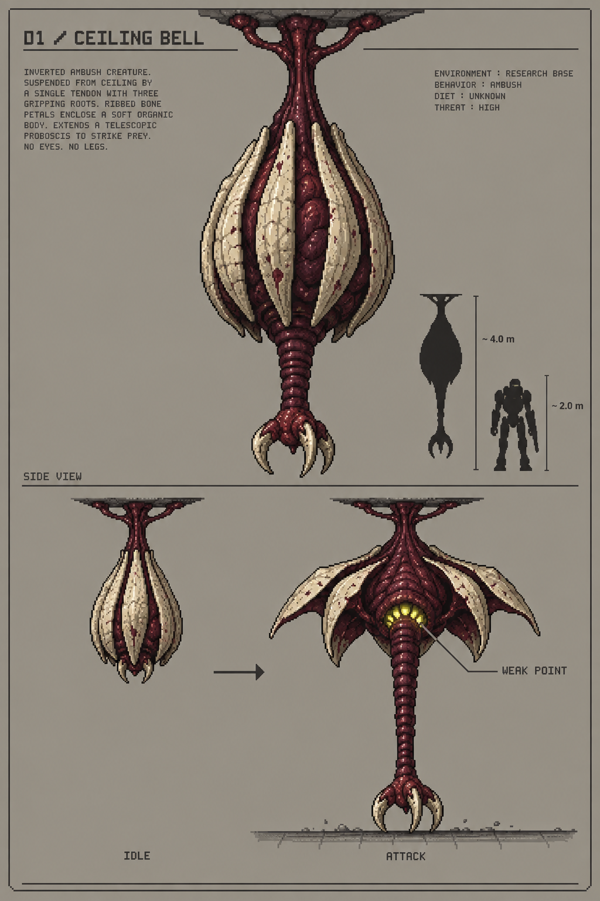
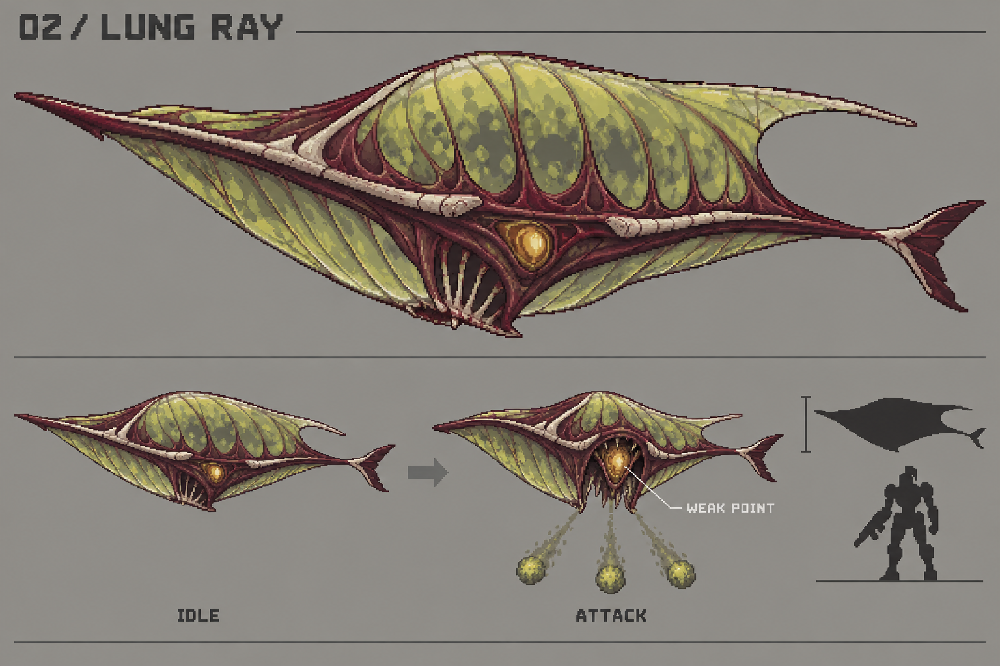
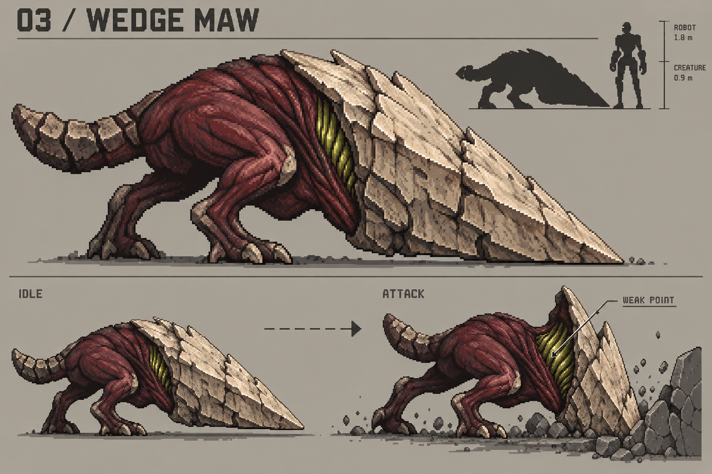
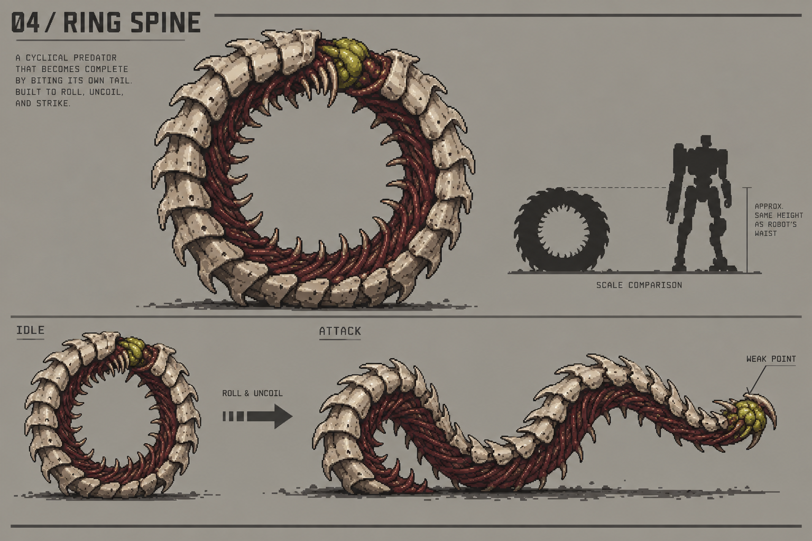
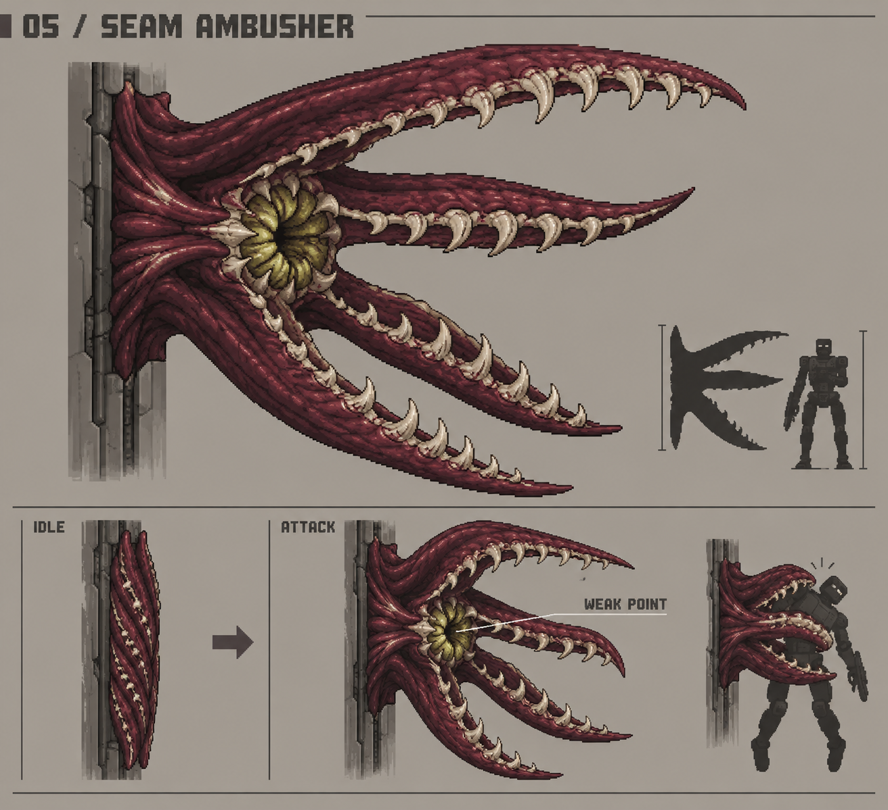

# 괴생명체 신규 콘셉트 5종

디자인 검토용 원화. 기존 붉은 조직·황록색 기관과 픽셀 아트의 선명한 윤곽을 이어가면서 체형·이동·전투 역할을 구별했다. 게임용 스프라이트 및 동작 구현은 포함하지 않는다. 그림의 로봇과 치수는 크기감 제안이며 엔진 규격이 아니다.

## 01 천장종 — 위에서 내려오는 덫

천장에 힘줄로 매달린 골질 종. 내부의 긴 포획구가 수직으로 뻗는다. 공격 직전 외피가 벌어지고 몸통이 수축해 위험을 예고한다. 옆으로 피한 뒤 열린 목의 황록색 고리 기관을 쏘는 적. 낮은 정비 통로와 엘리베이터 입구에 어울린다.

## 02 폐낭가오리 — 숨 쉬는 부유체

주름진 폐막을 부풀려 떠다니는 납작한 생물. 아래로 포자를 부채꼴로 뿜어 바닥의 안전한 위치를 바꾼다. 크게 들이쉬는 동작이 공격 예고이며, 내쉰 직후 배의 압력 기관이 열린다. 높은 재배실과 냉각실의 공중 위협.

## 03 쐐기턱 — 머리 전체가 방패인 돌진체

거대한 쐐기 모양 머리, 짧은 몸통과 강한 뒷다리 두 개로 구성된다. 앞쪽 골판으로 탄환을 막으며 직선으로 돌진한다. 발을 박고 머리를 낮추면 피할 준비를 해야 한다. 돌진 후 머리가 들리는 순간 뒤쪽 아가미가 노출된다. 긴 복도에서 위치 이동을 유도하는 역할.

## 04 환상척추 — 제 꼬리를 문 살아 있는 바퀴

척추 마디가 고리를 이루고 가운데가 비어 있다. 몸을 둥글게 잠가 빠르게 구르다가 고리를 풀어 낮고 긴 채찍처럼 휘두른다. 굴러올 때는 뛰어넘고, 펼쳐진 뒤 드러나는 꼬리 끝 기관을 노린다. 원형과 긴 S자 사이의 변형이 핵심 인상이다.

## 05 틈새꽃 — 벽의 틈이 벌어지는 포획체

네 장의 납작한 포획엽을 벽 틈에 접어 숨긴 고착 생물. 가까워지면 옆으로 펼쳐 커다란 입을 만든다. 접힌 가장자리의 움직임과 황록색 틈빛으로 매복을 미리 알아볼 수 있다. 포획이 빗나가 완전히 벌어졌을 때 중앙 인두를 공격한다. 문틀과 케이블 덕트 주변의 관찰형 위협.

## 제작 기록

- 내장 image_gen으로 생성.
- 기준 문서: `Docs/ART_GUIDE.md`, `Docs/TOXIC_TUMOR_CRAWLER_ANATOMY.md`.
- 직접 확인한 기존 이미지: `Assets/Generated/CharacterAnimation/ToxicTumorCrawler/toxic_tumor_crawler_base_v2.png`.
- 기준 비교: 붉은 몸통·황록색 기관·밝은 하이라이트는 계승하고, 기존 다족 종양 크롤러와 다른 외곽선 및 공격 축을 제안했다. 새 시안의 세부 밀도는 기존 스프라이트보다 높아 실제 픽셀화 전 별도 정리가 필요하다.
- 전체 생성 프롬프트: `prompts.md`.
