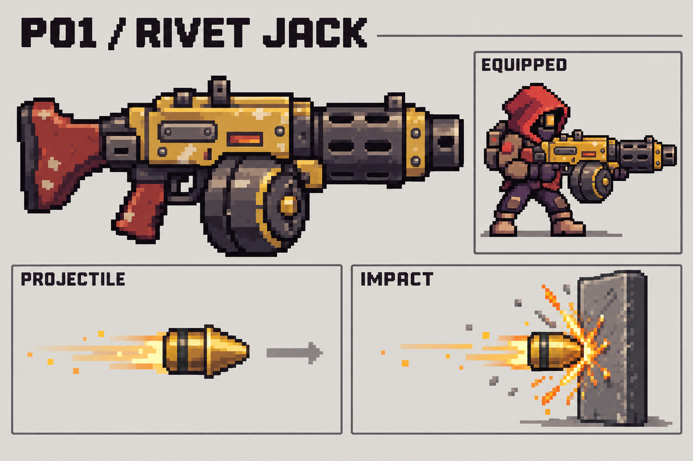
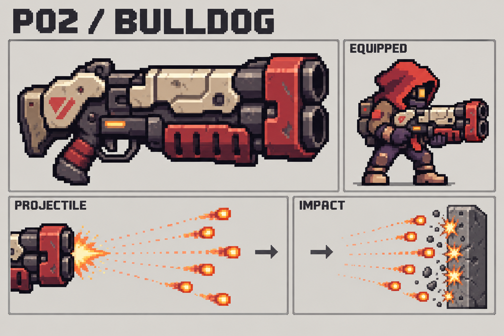
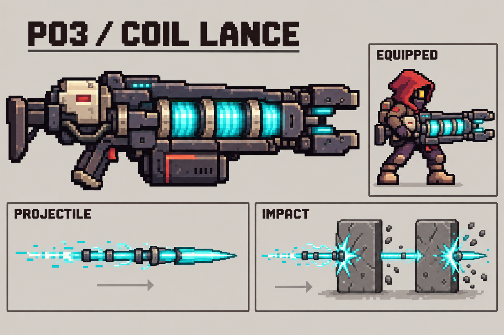
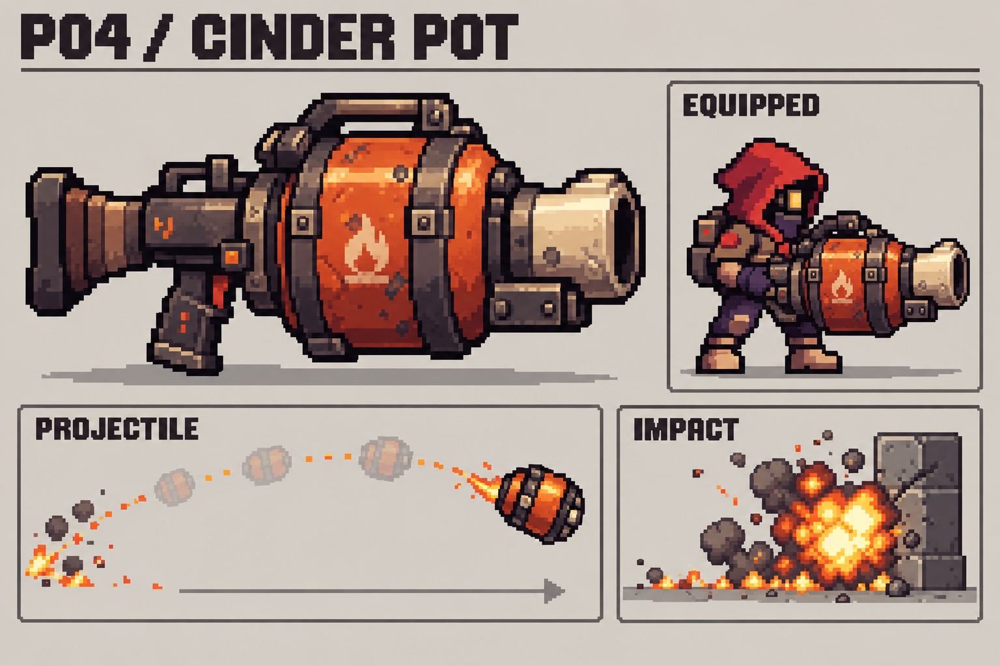
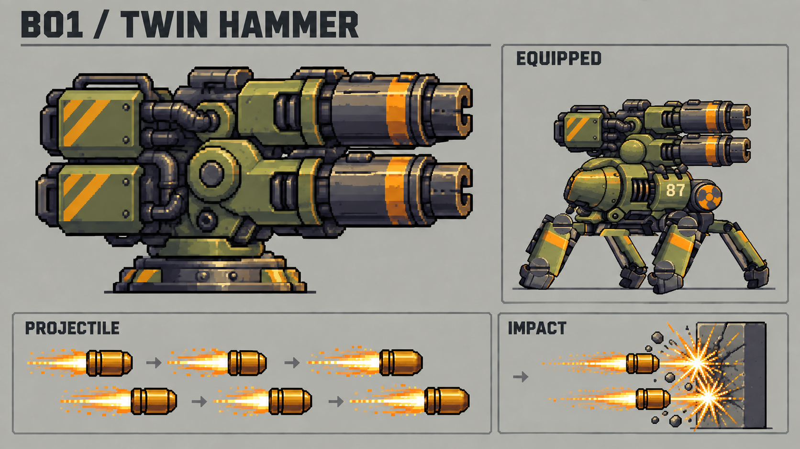
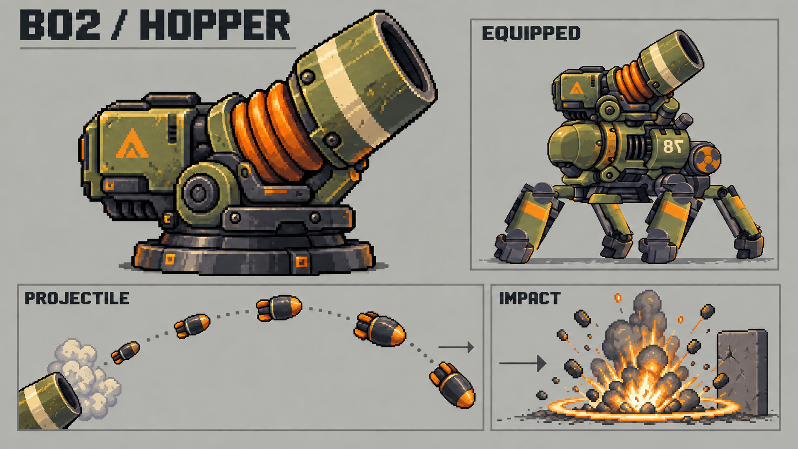
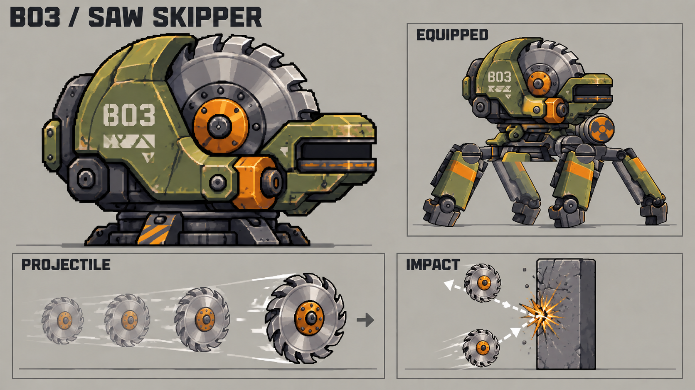
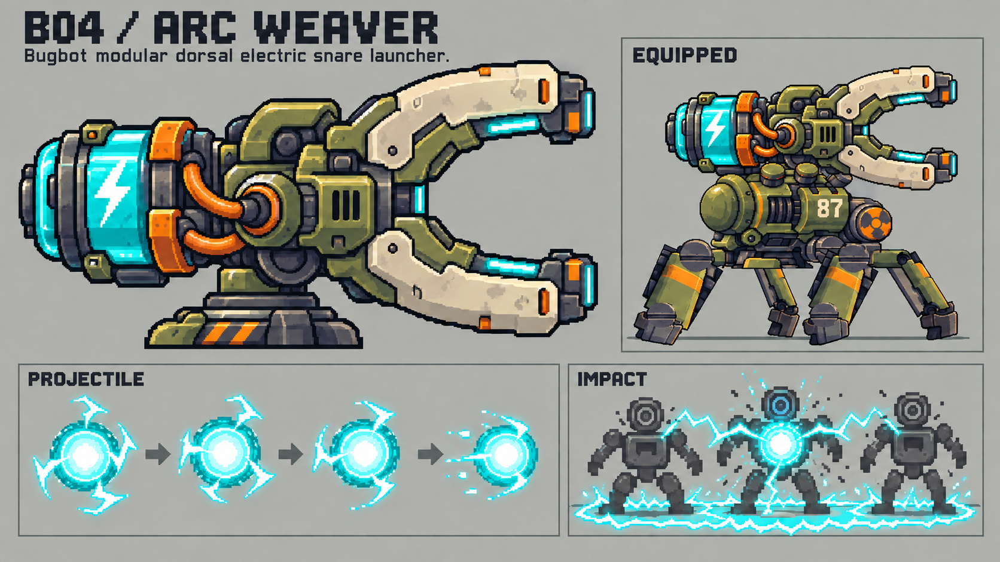

# 무기 콘셉트 시안 — 2026-09-28

플레이어용 4종, 버그봇용 4종. 모두 **선택 전 콘셉트 원화**이며 게임 구현이나 기존 리소스 교체는 하지 않았다.

각 한 장에 큰 무기 외형, 장착 예시, 투사체, 명중 효과를 함께 표현했다. 투사체는 형태 확인을 위해 확대했으며 무기와 같은 축척이 아니다. 반복된 탄 그림은 이동 과정/발사 리듬을 나타내며 실제 동시 발사 수 확정이 아니다.

## 공통 방향

- 메탈슬러그 캐릭터가 든 총처럼 과장된 총몸·총구·탄창으로 작은 화면에서도 식별한다.
- 플레이어용은 머리 크기의 두꺼운 총몸과 키의 약 65~95% 길이를 출발점으로 제안한다. 장착도는 비율 검토용이며 실제 월드 크기는 미확정이다.
- 플레이어는 직접 조준하는 손맛, 버그봇은 장착 모듈별 지원 역할을 구분한다.
- 붉은 후드 정비공, 올리브/황색 사족보행 버그봇의 기존 이미지와 픽셀 군집·마모·금속 명암을 참조했다.
- 버그봇의 장착도는 기존 몸통/다리를 참고한 교체 무장 방향이다. 선회·총구 위치·시야·충돌의 실제 호환성 검증은 선택 후 진행한다.

## 비교표

|구분|ID / 이름|역할|약점|
|---|---|---|---|
|플레이어|P01 리벳잭|중거리 연사|장시간 연사 시 산포|
|플레이어|P02 불독|근거리 산탄|거리별 위력 감소|
|플레이어|P03 코일랜스|충전 후 관통|충전 중 공격 공백|
|플레이어|P04 신더팟|곡사 유탄·잔불|탄속·재장전|
|버그봇|B01 트윈해머|쌍열 지속 제압|과열|
|버그봇|B02 호퍼|장애물 너머 포격|착탄 지연|
|버그봇|B03 쏘 스키퍼|톱날 도탄|개방 공간|
|버그봇|B04 아크위버|연쇄 전기·감속|낮은 직접 피해|

## P01 리벳잭 / RIVET JACK

- **외형:** 노란 사각 총몸 + 커다란 드럼 탄창 + 굵은 방열 총신
- **투사체·명중:** 빠른 황동 쐐기탄. 짧은 호박색 궤적과 작은 금속 스파크.
- **플레이 감각:** 중거리에서 이동하며 지속 사격. 누를수록 산포가 커져 짧게 끊어 쏘는 리듬.
- **동작 제안:** 사격 중 노리쇠 왕복, 탄창 흔들림, 짧고 빠른 총구 반동.
- **선택 참고:** 범용 연사형. 기존 사격과 비교하는 첫 후보.

## P02 불독 / BULLDOG

- **외형:** 아이보리 장갑 + 붉은 총구 테두리 + 위아래 두 개의 커다란 총열
- **투사체·명중:** 주황 펠릿이 부채꼴로 퍼지고, 여러 개의 짧은 타격 섬광 발생.
- **플레이 감각:** 근접한 적을 한 번에 밀어내는 산탄. 거리가 벌어질수록 효율 감소.
- **동작 제안:** 동시에 두 총구가 번쩍이고 상체가 크게 뒤로 젖혀짐. 재장전은 묵직한 절곡 동작.
- **선택 참고:** 큰 총을 든 맛과 근접 타격감이 뚜렷한 후보.

## P03 코일랜스 / COIL LANCE

- **외형:** 외부에 드러난 청록 코일 세 개 + 길고 두꺼운 레일 + 갈라진 총구
- **투사체·명중:** 긴 청록 바늘탄이 일직선의 여러 적을 관통. 좁고 선명한 관통 섬광.
- **플레이 감각:** 누르고 충전한 뒤 발사. 몰려오는 적을 한 줄로 정렬해 쏘면 보상.
- **동작 제안:** 코일이 뒤에서 앞으로 차례로 점등되고 발사 후 순차 소등.
- **선택 참고:** 관통은 적 대상이 기본 제안. 그림의 회색 블록은 관통 표적 표현이며 지형 관통 확정이 아님.

## P04 신더팟 / CINDER POT

- **외형:** 주황 솥 같은 커다란 약실 + 짧고 넓은 크림색 총구
- **투사체·명중:** 통 모양 유탄이 낮은 곡선으로 날아가 폭발하고 짧은 잔불을 남김.
- **플레이 감각:** 적 무리와 발밑을 겨냥하는 범위 공격. 느린 탄속과 재장전이 약점.
- **동작 제안:** 약실이 둔하게 흔들리고 큰 연기 퍼프가 나옴. 폭발 중심을 짧게 크게 밝힘.
- **선택 참고:** 직사 무기와 다른 조준 감각. 자해 여부·잔불 시간은 선택 후 결정.

## B01 트윈해머 / TWIN HAMMER

- **외형:** 올리브 쌍열 포신 + 두 개의 탄약 상자 + 낮은 회전 받침
- **투사체·명중:** 굵은 황금 탄이 두 총열에서 번갈아 발사. 엇갈린 짧은 궤적.
- **플레이 감각:** 주변 적을 계속 밀어내는 제압형. 연속 사격 시 과열로 잠시 냉각.
- **동작 제안:** 좌우/상하 총열이 번갈아 후퇴하고 열이 쌓이면 방열구가 주황빛.
- **선택 참고:** 현재 버그봇 자동 사냥의 연사·과열 구조와 비교하기 좋은 후보.

## B02 호퍼 / HOPPER

- **외형:** 대각선 위로 선 굵은 포신 + 주황 주름형 반동 완충부
- **투사체·명중:** 둥근 폭발탄이 높은 포물선을 그리며 낙하. 바닥에 원형 충격파.
- **플레이 감각:** 지형 위를 넘어 느린 무리를 포격. 착탄 지연 때문에 빠른 적에 약함.
- **동작 제안:** 발사 전 네 발을 낮게 고정하고 포신이 깊게 후퇴.
- **선택 참고:** 천장 높이와 아군 위치를 고려하는 조준 동작은 선택 후 설계.

## B03 쏘 스키퍼 / SAW SKIPPER

- **외형:** 반쯤 노출된 거대한 은색 톱니 원반 + 말굽형 외장 + 가로 발사구
- **투사체·명중:** 주황 축이 있는 은색 원반. 벽 표면에서 스파크와 함께 반사.
- **플레이 감각:** 좁은 통로에서 도탄으로 여러 적을 긁는 구역 제압. 개방 공간에서 효율 감소.
- **동작 제안:** 노출된 원반이 먼저 회전하고 발사 직후 다음 원반이 올라옴.
- **선택 참고:** 반사 횟수·재타격 간격을 제한하는 방향. 수치는 미확정.

## B04 아크위버 / ARC WEAVER

- **외형:** 오른쪽으로 열린 거대한 U자 전극 + 뒤쪽 청록 축전통
- **투사체·명중:** 청록 전기 구체가 명중하면 주변 적에게 짧은 번개가 연결.
- **플레이 감각:** 다수 적의 이동을 늦추는 지원형. 직접 피해는 낮아 다른 무기와 조합.
- **동작 제안:** 축전통 점등 → 두 전극 사이 스파크 → 구체 방출.
- **선택 참고:** 플레이어 고화력 무기와 조합했을 때 역할 차이가 큰 후보.

## 제작 기록

내장 image_gen으로 생성했다. [최초 프롬프트 전체](prompts.md), [검수 후 수정 프롬프트](refinement-prompts.md)를 보존한다. 버그봇 일부 장착도의 중복 총구를 제거하고, 톱날이 벽을 통과하지 않고 반사하도록 수정했다.

이미지는 콘셉트 비교용이므로 최종 팔레트·네이티브 해상도·애니메이션·사격 수치는 확정하지 않았다. ID로 선택 후 외형 보존 기준을 잡고 게임용 제작과 실제 동작 검증을 진행한다.

