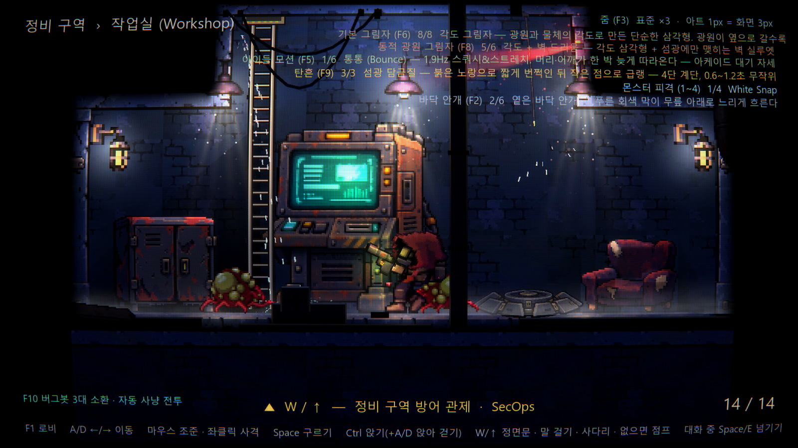
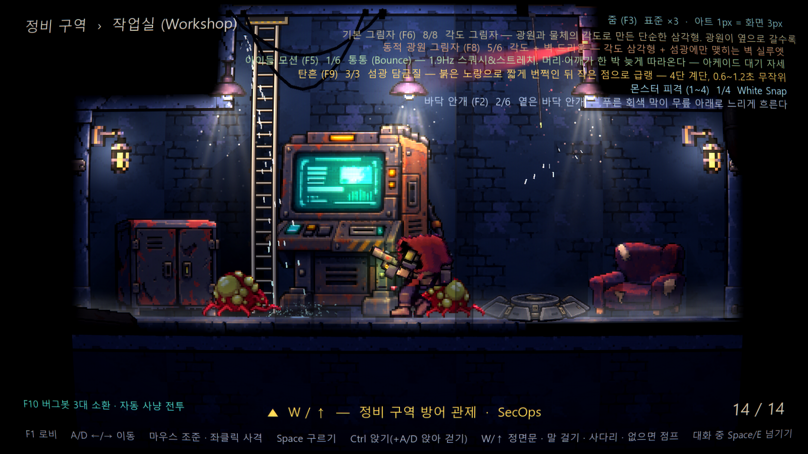
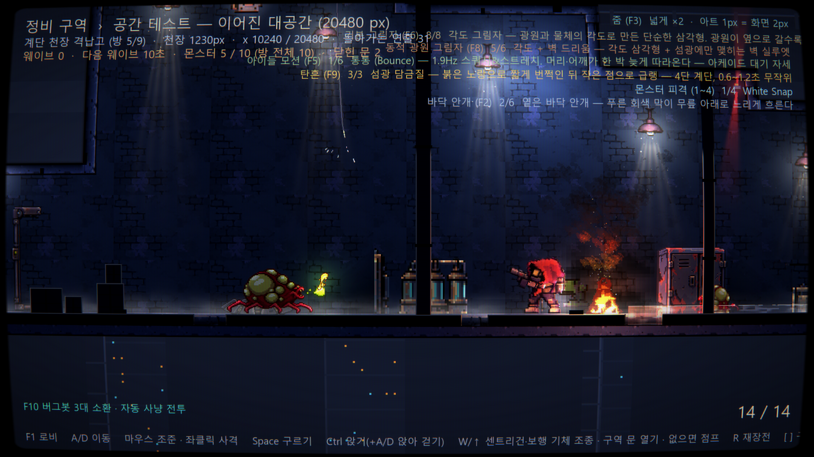
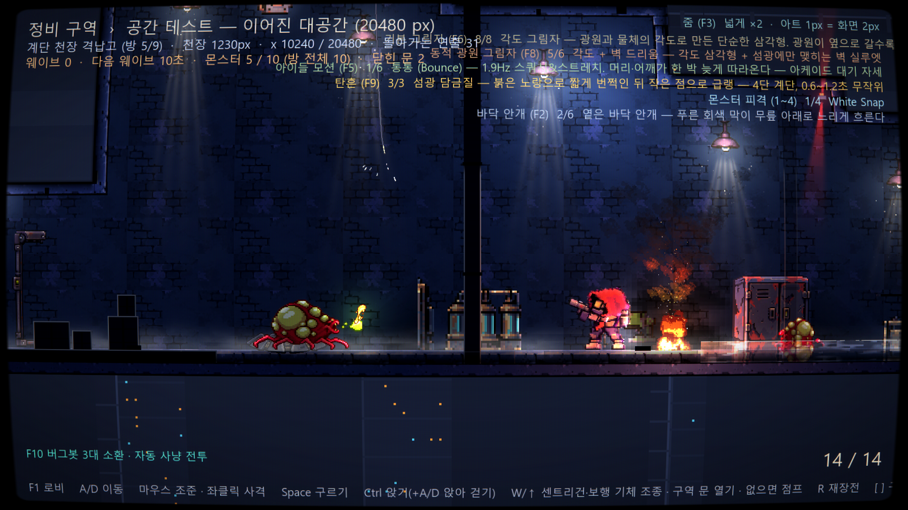
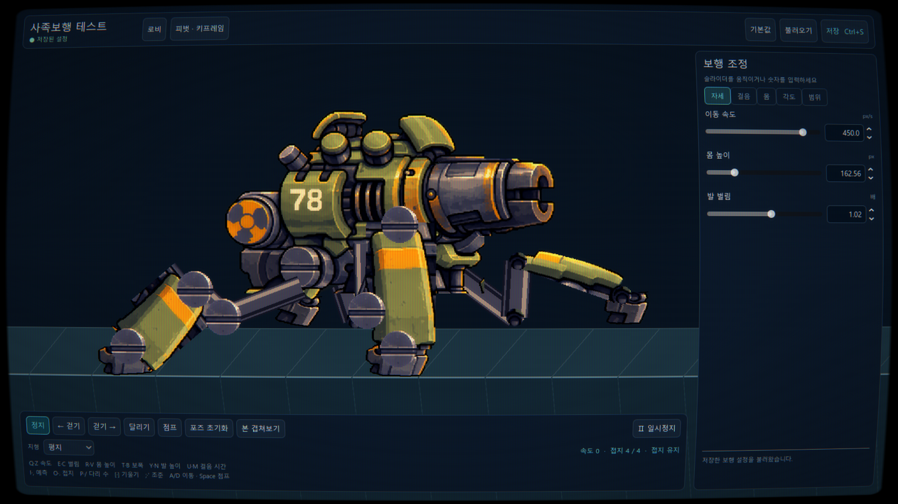
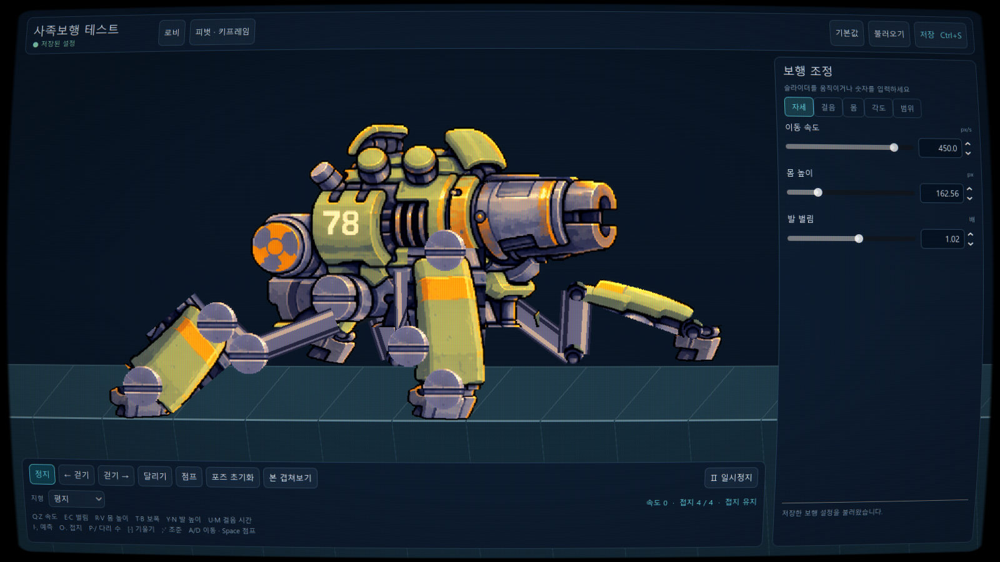

# 시인성 개선 — 실제 적용 및 캡처

2026-09-28. 이전 답변은 조사까지만 수행했다. 이번에는 게임의 공통 소스·셰이더를 수정하고 실제 장면을 다시 실행했다. 실행 중이던 게임 인스턴스에는 이미 생성된 머티리얼·노드가 남으므로 게임을 재시작해야 한다.

## 실제 변경

- 플레이어·NPC·일반/거대 크롤러: 공통 캐릭터 머티리얼에서 암부 색을 최대 45% 보강한다. RGB에 같은 배율을 곱해 색상과 검은 경계를 보존하며 밝은 픽셀에는 보강량을 줄인다. 이는 최종 화면 휘도 45% 증가를 보장한다는 뜻이 아니다.
- 버그봇: 게임과 보행 테스트가 공유하는 WalkerRig도 캐릭터 머티리얼을 사용한다. 기계의 노멀·금속 표면과 좁은 림은 유지한다.
- 캐릭터 벽 조명 비율 0.55 → 0.70, 바닥 조명 0.75 → 0.80. 새 광원을 추가하지 않았다.
- 배경 타일 specular_strength 0.85 → 0.48, normal_response 1.9 → 1.5. 캐릭터는 각각 0.50 / 1.4. 상호작용 소품의 원화는 유지했다.
- 캐릭터와 겹치는 근경 물체만 불투명도 25%로 전환하고, 벗어나면 100%로 돌아온다. 플레이어·NPC·살아 있는 크롤러·보행 기체를 고려한다. 패럴랙스를 반영한 좌표로 판정한다. 물체 단위 전환이며 픽셀 단위 구멍을 뚫는 방식은 아니다.
- 기본 arcade CRT: 주사선 0.36 → 0.22, 마스크 0.22 → 0.10, 색수차 0.6 → 0.2, halation 0.14 → 0.10. CRT 자체는 유지한다.
- 앞쪽 안개 농도는 기존의 절반. 뒤쪽 공기층은 유지한다.

## 적용 전후

1600×900, seed 4812, 씬 초기화 후 90프레임. 동일 조건으로 실행했지만 셰이더 TIME·파티클까지 픽셀 단위로 동일한 비교는 아니다. 캡처 도구는 개선값을 따로 주입하지 않고 실제 씬과 기본값을 읽는다.

### 작업실

적용 전:


적용 후:


캐릭터와 겹친 기둥·상자가 옅어지고, 몸통·다리와 작은 적의 경계가 더 잘 보인다.

### 공간 테스트

적용 전:


적용 후:


작은 배율에서도 크롤러 다리와 플레이어 총신의 경계가 선명해졌다. 화염 가까이는 여전히 강한 연출광이 있으므로 모든 전투 위치에서 동일한 가시성을 보장하는 결과는 아니다.

### 사족보행 테스트

적용 전:


적용 후:


버그봇 조각 31개 모두 공통 actor_fill 파라미터 적용을 확인했다. 어두운 관절·다리가 더 밝게 읽히며 CRT 간섭이 줄었다.

## 씬별 적용 확인

시각 씬 18개를 모두 새로 실행해 PNG 저장 성공. 이 중 공통 게임 캐릭터를 실제로 생성하는 12개에서 조사 시점의 모든 캐릭터 머티리얼에 actor_fill > 0을 확인했다. 수치는 고유 캐릭터 수가 아니라 노드에 연결된 머티리얼 수다.

| 씬 | 보정된 캐릭터 머티리얼 / 조사된 수 | 비고 |
|---|---:|---|
| Main | 8 / 8 | 방 타일·근경 포함 |
| MainGame | 8 / 8 | 본편 시작점 |
| SpaceLab | 109 / 109 | 공간 테스트, 버그봇 포함 |
| DepthLab | 42 / 42 | 깊이·근경 테스트 |
| FaceLab | 8 / 8 | 조명 테스트 |
| ScaleLab | 6 / 6 | 배율 테스트 |
| DialogueLab | 7 / 7 | 대화·NPC |
| CrawlerDeathLab | 3 / 3 | 사망 애니메이션 |
| HitFxShowcase | 8 / 8 | 피격 효과 비교 |
| WalkerLab | 31 / 31 | 현재 보행 테스트 |
| WalkerLegacyLab | 23 / 23 | 이전 보행 테스트 |
| MapViewer | 2 / 2 | 미리보기 방 |
| WalkerAuthoringLab | 해당 없음 | 원화·피벗·뼈대 편집 화면. 공통 CRT만 적용 |
| ServiceGalleryPreview | 해당 없음 | 자산 프리뷰. 공통 CRT 적용 |
| ServiceGalleryPack | 해당 없음 | 자산 프리뷰. 공통 CRT 적용 |
| ServiceGalleryLightProp | 해당 없음 | 자산 프리뷰. 공통 CRT 적용 |
| CoolantPumpRoomAssetPreview | 해당 없음 | 자산 프리뷰. 공통 CRT 적용 |
| Lobby | 해당 없음 | 로비. 공통 CRT 적용 |

전체 기록: [coverage.json](../research-images/readability-applied/after/coverage.json). 각 PNG는 같은 폴더의 `<씬 이름>.png`에 있다. 원화 편집·자산 전시 화면에 게임용 캐릭터 보정을 일괄 적용했다는 뜻은 아니다.

## 검증과 남은 한계

- `validate_readability.gd`: PASS. 플레이어·새로 생성된 크롤러·기계 재질 보정, 프리셋 재적용 후 유지, 근경 가림/복원 및 근경 재생성 확인.
- `HitFxInputTest.tscn`: PASS. 기존 숫자키 피격 프리셋 전환 정상.
- 실제 렌더 캡처 실행에서 스크립트 파싱·셰이더 컴파일 실패 없음. 샌드박스의 user:// 로그·셰이더 캐시 저장 오류, 인증서 저장소 오류와 종료 시 리소스 잔존 경고는 기록되어 있다. 이미지 저장은 18개 모두 성공했다.
- `TerminalTest.tscn`: 별도 실패 1건. 선택 대상 `walker_cable`을 테스트 코드 180행이 `sentry_by_id()`로 검색한다. 보행 기체를 포탑으로 찾는 검사 경로이며 이번 시인성 수정과 별개의 테스트 문제로 남겼다. 전체 회귀 검사가 통과했다고 보고하지 않는다.
- `AutoTest.tscn`은 Main을 사용하는 자동 입력·촬영 러너다. 공통 변경은 상속되지만 이 러너의 전체 시나리오는 이번에 끝까지 실행하지 않았다.
- 정적 캡처·동작 검증으로 적용을 확인했다. 사용자 반응 시간이나 모든 위치의 전투 가독성을 측정한 것은 아니다.

재현:

```powershell
godot --path GodotPrototype --audio-driver Dummy --fixed-fps 60 --script res://tools/capture_readability_scenes.gd -- after
godot --headless --path GodotPrototype --script res://tools/validate_readability.gd
```
