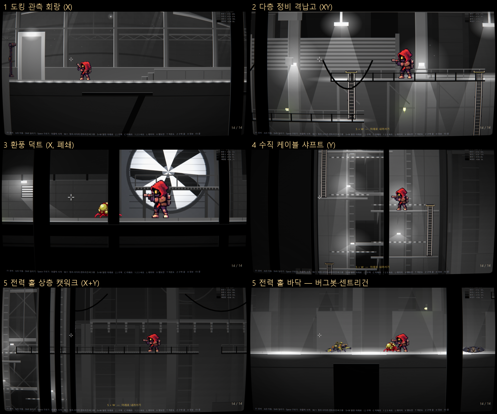

# 공간감 테스트 씬 — 이어진 다섯 공간 (그레이박스)

*작성 2026-09-25 · 갱신 2026-09-26 · 대상 `GodotPrototype/scenes/DepthLab.tscn`*

이 씬은 서로 다른 성격의 공간 다섯 개를 **한 줄로 이어 붙인** 그레이박스다. 다음 여섯 가지를 확인한다.

- 패럴렉스 레이어로 만든 깊이
- 박스 명도로 나눈 레이어 톤: 공기 원근, 빛과 어둠의 그라데이션
- 깊이마다 다르게 닿는 조명
- 점프와 사다리를 쓰는 동선
- 끊김 없이 이어지는 탐험감
- 카메라 워킹

로비 우상단 **▥ 공간감 테스트 — 이어진 다섯 공간**으로 들어간다.

본편과 같은 플레이 루프(`main.gd` 상속)를 쓴다. 이동·조준·**사격**·구르기·**크롤러**·**센트리건 2대**·**버그봇(사족보행 기체)**이 그대로 돈다. 방 타일만 숨긴다. 충돌(`RoomSolid`)과 몬스터의 벽·천장 타기는 방 모양(열 프로필)을 그대로 쓴다.



## 1. 공간 구성 — 서사에서 가져온 다섯 곳

배경 서사는 붕괴 중인 연구·산업 기지다. 플레이어는 AI 로봇 UNIT-7이다 (`AI_Robot_Base_Narrative_Design_Notes.md`, `STATION_MAP.md`).

기존 맵의 요소를 공간 구도의 전형으로 뽑았다.

- 정비 구역의 격납고·대형 정비 홀
- 전력 구역의 케이블 덕트·전력 릴레이실
- 높이 9셀짜리 굴뚝형 방
- 낮은 복도

외부가 보이는 공간은 문서에 없다. 요청에 따라 "도킹 관측 회랑"을 새로 가정했다.

| # | 공간 | 구도 | 핵심 |
|---|---|---|---|
| 1 | **도킹 관측 회랑** | X · 가장 넓음 | 관측창 너머로 행성 원호, 자매 정거장(고리·허브·전지판), 선체 트러스가 보인다. 행성광이 아래에서 올라와 모서리에 림을 맺는다(역광) |
| 2 | **다층 정비 격납고** | XY | 상자 두 단 → 1층 갠트리(360) → 사다리 → 2층 갠트리(760) 순으로 오른다. 천장 투광등이 층마다 빛 웅덩이를 떨군다. 센트리건 |
| 3 | **환풍 덕트** | X · 폐쇄 | 머리 위가 286px로 막혀 점프할 수 없다. 기어가야 하는 구간(틈 200)이 있다. 거대 환풍기실에서는 회전 날개가 빛을 잘라 방 전체가 깜빡인다 |
| 4 | **수직 케이블 샤프트** | Y | 사다리 A → 턱 600 → 점프 → 턱 760 → 사다리 B → 턱 1360 → 점프 → 턱 1520 → 사다리 C → 2120으로 오른다. 아래는 어둠, 위는 채광이다 |
| 5 | **전력 홀 상층 캣워크** | X + Y | 높이 2240의 캣워크다. 끊긴 구간 300px는 **달려서** 뛰어야 넘는다. 아래는 코일 탑이 선 홀이고, 빛이 **바닥에서 올라온다**. 크레인 발판으로 내려가거나 끝의 긴 사다리를 탄다. 홀 바닥에 버그봇·센트리건 |

동선은 두 갈래이고, 한 바퀴로 이어진다.

```
아래층: 회랑 ─ 격납고 ─ 덕트 ─ 샤프트 바닥 ─ 전력 홀 바닥 (끝까지 걸어서)
윗길:           격납고 2층        샤프트 꼭대기 ═ 캣워크 ═══ 긴 사다리 ↓ 홀 바닥
```

**구역마다 줌이 자동으로 바뀐다.** 회랑·샤프트·캣워크는 넓게(−1), 격납고는 표준, 덕트는 가깝게(+1)로 0.6초에 걸쳐 옮겨 간다. 세로 프레이밍도 구역마다 섞인다. 샤프트는 몸을 화면 가운데에 두어 위아래를 함께 본다.

## 2. 레이어 — 구역마다 잘린 패럴렉스

역할은 **배경판 · 원경 3 · 원경 2 · 원경 1 · 뒤벽 · 땅 · (앞 난간) · 근경 1 · 근경 2**다. 구성은 `L` 키로 많음 8 / 기본 6 / 적음 4를 오간다.

구역마다 레이어를 **따로 만들고 그 구역의 월드 범위로 잘라낸다**(`clip_children`). 먼 레이어가 느리게 흘러도 이웃 구역 배경이 섞여 들지 않는다. 경계는 땅 레이어의 문틀이 덮는다. 가로와 세로 모두 같은 계수로 움직여서, 샤프트를 오르면 먼 레이어가 덜 올라간다.

| 키 | 속도 프리셋 | 배경판 → 원경3 → 원경2 → 원경1 → 뒤벽 → 땅 → 근경1 → 근경2 |
|---|---|---|
| 1 | 얕은 무대 | 0.30 · 0.45 · 0.58 · 0.72 · 0.88 · 1 · 1.10 · 1.22 |
| 2 | **아케이드 표준** | 0.06 · 0.18 · 0.32 · 0.52 · 0.80 · 1 · 1.30 · 1.65 |
| 3 | 깊은 공동 | 0.00 · 0.06 · 0.16 · 0.36 · 0.70 · 1 · 1.60 · 2.30 |

덕트는 예외다. 뒤벽 0.96, 원경1 0.82로 고정한다. 안벽이 거의 붙어 온다.

**앞 난간**(계수 1, 인물 앞)은 캣워크·갠트리 앞 모서리의 무릎 아래 난간이다. 근경은 발밑과 화면 위 테두리에만 둔다. 샤프트에서 인물을 가로지르던 수평 근경은 뺐다.

## 3. 명도 — 공기 원근과 빛/어둠 그라데이션

구역마다 톤이 따로 있다 (`depth_lab_data.gd` `ZONES[].tone`).

```
레이어 대표 명도 = lerp(albedo, fog, haze[역할])     멀수록 안개 명도로 녹는다
레이어 안 면 대비 = 면 명도 차 × (1 − haze[역할])     멀수록 면 구분이 흐려진다
```

- **주광 방향이 구역마다 다르다** (`key`).
  - 회랑: `back` 역광. 윗모서리에 림이 맺힌다.
  - 격납고·덕트·샤프트: `top`. 윗면이 밝고 옆면이 어둡다.
  - 전력 홀: `bottom`. 밑모서리가 밝고 윗면이 어둡다. 빛이 아래에서 온다.
- **그라데이션**은 다섯 가지다.
  - 낮게 깔린 안개 (먼 레이어 아래쪽)
  - 샤프트의 아래쪽 어둠: 원경·뒤벽 모두 바닥으로 갈수록 검다
  - 덕트 가운데로 짙어지는 어둠: 양 끝만 바깥 빛이 든다
  - 전력 홀의 올라오는 빛
  - 빛줄기·빛 원뿔·빛 웅덩이 (가산)
- `V` **명도만 보기**는 레이어마다 대표 명도 한 값만 남긴다. 레이어 간 명도 계단만 보인다.
- `T` **색온도 힌트**는 명도를 그대로 두고 색만 민다. 먼 곳은 구역색(회랑 청색, 전력 홀 주황)으로, 조명은 따뜻하게.

## 4. 조명 — 한 광원이 깊이마다 다르게 닿는다

`depth_lab_lights.gd`

1. **구역 광원**은 역할마다 PointLight2D 하나씩으로 쪼갠다.
   - 각 조각은 그 역할의 z만(`range_z_min = max`), 그 구역 레이어만(`range_item_cull_mask` = 구역 비트) 비춘다. 비율도 역할마다 다르다.
   - 예: 격납고 투광등은 땅 1.0 · 뒤벽 0.55 · 원경1 0.2 · 원경2 0.06 · 근경 0.35 · 앞 난간 0.5로 닿는다.
   - 같은 월드 위치에 서 있으므로 광원 **바로 뒤의 먼 면**과 **바로 앞의 근경**이 함께, 깊이만큼 약하게 물든다.
   - 구역별 광원: 회랑 행성광·에어록 등 · 격납고 투광등 3 · 덕트 경고등 2(맥박) + 환풍기(날개 각도로 깜빡임) · 샤프트 채광창 + 턱 작업등 5 · 전력 홀 바닥 조명 4.
2. **움직이는 광원**(총구 화염·탄착·센트리건 섬광)은 원본이 땅~인물 층만 비추게 줄인다. 대신 깊이 거울이 뒤벽 0.5 · 원경1 0.22 · 원경2 0.08 · 근경 0.45로 **넓고 약하게** 번진다. 쏘면 가까운 층부터 번쩍인다.
3. **인물 밝기**는 이렇게 정한다.
   - 방 CanvasModulate는 흰색이다. 레이어 명도가 곧 최종 명도다.
   - 플레이어·크롤러·센트리건·버그봇·사다리는 구역 기본 밝기에 가까운 광원을 더한 값을 받는다.
   - 덕트에서는 인물도 어둡고, 환풍기 날개가 지날 때 같이 깜빡인다.
   - 샤프트는 올라갈수록 밝아진다.

Godot 2D는 아이템 하나당 라이트 15개까지만 적용한다. 그래서 레이어를 구역별로 자르고, 카메라에서 먼 광원은 끈다.

## 5. 조작

| 키 | 기능 |
|---|---|
| A/D · Shift · Space · 좌클릭 · R | 이동 · 달리기 · 구르기 · 사격 · 재장전 (본편 그대로) |
| **W/↑** | 점프 (머리 위 여유가 있을 때만) · 사다리 잡기 · 센트리건/버그봇 (바닥에서) |
| **S + W** | 발판(캣워크·갠트리·턱) 아래로 내려서기 |
| 사다리 꼭대기에서 **S** | 사다리를 잡고 내려가기 · 사다리 위 A/D는 손 놓기 |
| Ctrl / S | 웅크리기 · 기어가는 구간은 웅크린 채 A/D |
| **[ ]** | 구역 이동 |
| **C** | 카메라 워킹 프리셋 (Shift = 이전) |
| 1 2 3 · L · V · T | 패럴렉스 속도 · 레이어 수 · 명도만 · 색온도 |
| Z · F3 · H · F1 | 구역 줌 자동 켜기/끄기 · 줌 직접 · 정보 · 로비 |

높은 발판 위에 있으면 아래층 크롤러의 근접 공격은 닿지 않는다. 산성 침은 실제 위치로 맞는다.

## 6. 카메라 워킹 프리셋 (C)

| 이름 | 성격 |
|---|---|
| 표준 | 본편 기본값. 포인터 쪽 1/3까지 |
| **조준 밀기** (기본) | 쏘는 동안 리드를 1.9배로 늘린다. 위아래 260까지 보고, 발사 방향으로 살짝 쏠린다 |
| 반동 킥 | 한 발마다 조준 반대쪽으로 16px 튕겼다 돌아온다 |
| 중간점 (트윈스틱) | 캐릭터와 포인터의 가운데를 본다. 멀리 쏠수록 멀리 보인다 |
| 속도 앞보기 | 이동 속도 × 0.55초 앞을 먼저 연다 |
| 시네마틱 | 느린 추적과 큰 리드에 숨쉬듯 흔들림을 더한다. 넓은 공간을 보여 주는 용도 |
| 민첩 | 본편 민첩형에 반동을 더했다 |

## 7. 파일 · 검사

| 파일 | 역할 |
|---|---|
| `scripts/depth_lab.gd` | 씬 (main.gd 상속). 레이어 배치 · 세로 프레이밍 · 카메라 효과 · 입력 · 정보 표시 |
| `scripts/depth_lab_data.gd` | 구역 · 발판 · 사다리 · 기어가기 · 속도 · 카메라 프리셋 · 톤 · 방 등록 (수치는 전부 여기) |
| `scripts/depth_lab_builder.gd` | 구역 × 역할 그레이박스 도형 |
| `scripts/depth_lab_motion.gd` | 발판 물리 (층 높이 · 원웨이/솔리드 · 사다리 · 내려서기 · 기어가기) |
| `scripts/depth_lab_lights.gd` | 구역 광원 분할 · 움직이는 광원 깊이 거울 · 인물 밝기 |
| `scripts/depth_lab_fan.gd` · `depth_layer.gd` | 회전 환풍기 · 레이어 한 장 (본체 + 가산 빛 겹) |
| `tools/validate_depth_lab.gd` | 동선 8종 검사. 사다리 착지 · 턱 점프 · S+W · 기어가기 막힘/통과 · 캣워크 달려 뛰기 · 긴 사다리 · 사격 |
| `tools/depth_lab_smoke.gd` · `tools/depth_lab_shot.gd` | 프리셋·구역 전부 돌리기 · 스크린샷 16장 |

```
godot --path GodotPrototype --script res://tools/validate_depth_lab.gd
```

2026-09-26 결과: 동선 검사 8/8 통과. 스모크에서 센트리건 2 · 버그봇 1 · 크롤러 5를 확인했고, 스크립트 오류는 없었다.

## 8. 이번 범위가 아닌 것

- 속도·톤·조명 비율의 확정과 본편 방 반영. 비교한 뒤 결정한다.
- 발판 위 몬스터 이동. 크롤러는 바닥과 방의 벽·천장만 탄다.
- 실제 원화 레이어. 이 씬은 그레이박스 기준을 정하는 용도다.
