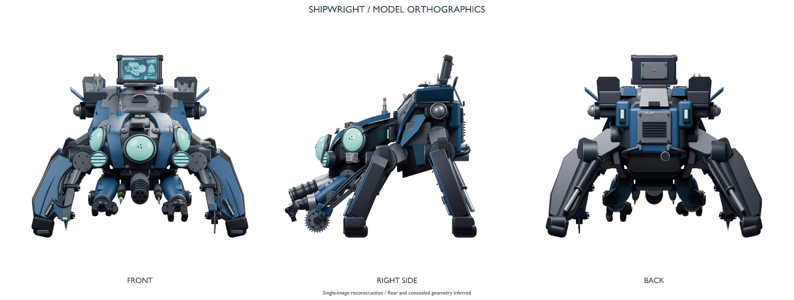

# SHIPWRIGHT Blender 모델링 작업 요약

작업 기간: 2026-10-01~2026-10-02 (한국 시간)

최종 전달 버전: **v6**

상태: 사용자의 “모델링은 여기까지 해주고, 마무리해줘” 요청에 따라 현재 버전으로 저장·검증·패키징을 마치고 자동 모델링 진행을 일시중지했다.

## 작업 범위와 결과

이 PC의 Blender를 스크립트로 제어할 수 있는 작업 환경을 구성하고, 사용자가 제공한 정비 로봇 원화 한 장을 바탕으로 참고 3면도와 편집 가능한 3D 모델을 제작했다. 최종 모델에서 정면·우측면·후면을 직접 렌더링한 3면도, GLB, 대표·상세 이미지와 ZIP 전달본을 저장했다.

**원화와 완전히 동일한 모델로 검증된 결과는 아니다.** 사용자가 원본 자료는 한 장뿐이라고 확인했으므로 후면과 가려진 연결 구조는 추정했다. 일부 비례·장갑 윤곽·기계 디테일·재질 표현에도 차이가 남아 있다. 현재 버전에서 마무리한 사실을 완전 일치나 게임 적용 완료로 해석하지 않는다.

## 최종 파일

| 파일 | 용도 |
|---|---|
| [Shipwright_final_v6.zip](../Deliverables/Shipwright/Shipwright_final_v6.zip) | 최종 전달 묶음. Blender 원본, GLB, 렌더 6장, README 포함 |
| [shipwright.blend](../Deliverables/Shipwright/shipwright.blend) | 부품별 편집 가능한 Blender 원본. 참고 이미지 내장 |
| [shipwright.glb](../Deliverables/Shipwright/shipwright.glb) | 다른 3D 프로그램으로 가져오기 위한 정적 모델 |
| [model_turnaround.png](../Deliverables/Shipwright/renders/model_turnaround.png) | 실제 모델의 정면·우측면·후면 3면도 |
| [hero.png](../Deliverables/Shipwright/renders/hero.png) | 대표 렌더 |
| [detail.png](../Deliverables/Shipwright/renders/detail.png) | 얼굴·장비 상세 렌더 |
| [front.png](../Deliverables/Shipwright/renders/front.png), [right.png](../Deliverables/Shipwright/renders/right.png), [back.png](../Deliverables/Shipwright/renders/back.png) | 개별 정투영 이미지 |
| [original_concept.png](../Deliverables/Shipwright/references/original_concept.png) | 사용자가 제공한 원화 사본 |
| [concept_turnaround.png](../Deliverables/Shipwright/references/concept_turnaround.png) | 내장 이미지 생성 도구로 만든 해석적 참고 3면도 |
| [turnaround_prompt.txt](../Deliverables/Shipwright/references/turnaround_prompt.txt) | 참고 3면도 생성에 사용한 프롬프트 |



생성된 참고 3면도는 보이지 않는 형상을 확인해 주는 원본 도면이 아니다. 모델의 최종 형상을 확인할 때는 실제 모델에서 렌더링한 `model_turnaround.png`를 사용한다.

## Blender 작업 환경

- 설치된 **Blender 5.2.2 LTS** 실행 파일을 사용했다. Blender Python API로 모델 생성·수정·저장·내보내기·렌더를 수행한다.
- [run_blender.ps1](../Tools/Blender/run_blender.ps1)은 별도 백그라운드 프로세스를 실행한다. `--factory-startup`, `--disable-autoexec`, `--python-exit-code 1`을 사용하며, 열려 있는 대화형 Blender 창을 직접 편집하지 않는다.
- 현재 PC의 Blender 실행 경로는 Git에서 제외한 `Tools/Blender/config.json`에 저장한다. 다른 PC에서는 [config.example.json](../Tools/Blender/config.example.json)을 복사한 뒤 설치 경로를 수정한다.
- 이 설치 환경에서 OptiX 커널 로딩 오류가 발생해 **Cycles CPU 렌더링**으로 진행했다.
- PowerShell 실행 정책은 명령 실행 시에만 `-ExecutionPolicy Bypass`를 지정했다.
- [setup_probe.py](../Tools/Blender/setup_probe.py)로 테스트 상자의 모델링, 재질, `.blend` 저장, GLB 내보내기, CPU 렌더를 확인했다. 결과와 [verification.json](../Deliverables/BlenderSetup/verification.json)은 `Deliverables/BlenderSetup/`에 보관한다.

## 모델 구성

- 축 기준은 X=폭, -Y=정면, Z=위쪽이다. 미터 단위를 사용하지만 원화에 실제 치수가 없어 전체 크기는 임의로 정했다.
- 모델은 몸통·등 장갑, 머리와 렌즈, 네 개의 지지 다리, 좌우 조작 팔과 손, 중앙 회전 공구와 정밀 프로브, 용접 도구, 원형 톱, 후면 팩, 공구함, 진단 모니터 등으로 나눴다.
- 큰 민트색 렌즈 3개, 작은 작업등, 청색 장갑, 금속 관절, 볼트, 배관, 경첩, 공구와 문자 요소를 별도 부품으로 만들었다.
- 원화의 모니터 화면과 작은 명판 이미지는 UV 데칼로 적용했다. 참고 이미지와 사용 텍스처는 Blender 파일에 포함했다.
- `.blend`는 편집 가능한 곡선·문자·모디파이어를 유지한다. GLB 내보내기는 별도 메모리 상태에서 메시로 변환하며 스튜디오 바닥·카메라를 제외한다.

## 주요 보정 과정

| 단계 | 작업 내용 |
|---|---|
| 초기 제작 | 참고 3면도 생성, 몸통·머리·다리·도구 등 부품별 모델 구축, 재질·조명·카메라 배치 |
| 렌즈·표면 보정 | 서로 겹치던 렌즈 구성을 볼록 렌즈와 중공 테두리로 변경. 원화의 화면·명판 적용, 틈과 배관 연결 점검 |
| v2 | 안테나 높이, 머리·어깨 장갑 곡면, 짧고 둥근 전완, 손당 세 손가락, 이마 카메라, 접힌 용접 방패와 공구함 뚜껑 보정 |
| v3~v4 | 무릎을 평평한 금속 덮개로 변경, 곡면을 따르는 머리 테두리와 통풍구, 어깨 은색 패널 추가, 다리 관절 높이와 자세 조정 |
| v5 | 목 연결점을 기준으로 얼굴 폭·길이·높이 조정, 어깨 표면에 맞춘 은색 패널, 측면 렌즈 각도와 불투명 뒷판, 이마 카메라 위치 보정 |
| v6 | 머리 아래 공구 지지 덮개와 팔 연결부 추가, 좌우 손가락 길이·굽힘 차이와 분절 형상 조정, 중심 위치를 유지하며 렌즈 크기 축소 |
| 마무리 | 사용자의 중단 요청 이후 추가 형상 수정 없이 최종 저장, GLB 재불러오기, 렌더 갱신, ZIP 생성 및 내용 확인 |

v5에서는 중앙 눈·가까운 측면 눈·이마 카메라의 세 기준점을 비교했다. 눈 사이 간격 대비 이마 카메라까지의 거리 비율이 원화의 수동 관측값 약 0.648에 대해 약 0.658이었다. 이는 세 지점에 한정된 대략적인 배치 비교이며 전체 형상 일치율이 아니다. v6에서 렌즈 크기가 바뀌었으므로 [face_landmark_comparison.json](../Deliverables/Shipwright/face_landmark_comparison.json)은 **v5의 과거 기록**으로만 사용한다.

## 최종 검증

| 검증 항목 | 결과·범위 |
|---|---|
| Blender 원본 재열기 | 성공 |
| 주요 부품 구성 | 큰 렌즈 3개, 지지 다리 4개, 조작 손 2개, 손당 손가락 3개 확인 |
| 참고 이미지 포함 | 확인 |
| 원본 메시 검사 | 메시 객체 1,137개, 평가된 삼각형 289,104개, 면적이 0인 삼각형 0개 |
| GLB 재불러오기 | 성공. 메시 객체 1,167개, 삼각형 349,064개, 내장 이미지 1개 |
| 내보내기 범위 | 스튜디오 바닥·카메라 제외 확인 |
| 렌더 | 최종 모델의 대표·상세·정면·우측면·후면 및 합성 3면도 저장 |
| ZIP | 9개 파일 포함 여부 확인. 22,975,151바이트 |

원본과 GLB의 객체·삼각형 수 차이는 곡선·문자·모디파이어의 메시 변환 등에서 발생한다. 검증 근거는 [geometry_audit.json](../Deliverables/Shipwright/geometry_audit.json), [export_audit.json](../Deliverables/Shipwright/export_audit.json), [delivery_manifest.json](../Deliverables/Shipwright/delivery_manifest.json), [fidelity_review.json](../Deliverables/Shipwright/fidelity_review.json)에 기록했다. 파일 검사 성공은 원화와의 시각적 동일성을 증명하지 않는다.

## 재실행 방법

저장소 루트에서 실행한다. 먼저 `config.example.json`을 `config.json`으로 복사하고 `executable`을 해당 PC의 Blender 설치 경로로 수정한다.

```powershell
Copy-Item .\Tools\Blender\config.example.json .\Tools\Blender\config.json

# 환경 확인용 테스트 상자 생성
& "$PSHOME\powershell.exe" -NoProfile -ExecutionPolicy Bypass -File .\Tools\Blender\run_blender.ps1 -Script .\Tools\Blender\setup_probe.py

# 전체 모델 재생성 및 내보내기·렌더
& "$PSHOME\powershell.exe" -NoProfile -ExecutionPolicy Bypass -File .\Tools\Blender\run_blender.ps1 -Script .\Tools\Blender\build_shipwright.py

# 실제 모델의 세 정투영 렌더를 한 장으로 조합
& "$PSHOME\powershell.exe" -NoProfile -ExecutionPolicy Bypass -File .\Tools\Blender\run_blender.ps1 -Script .\Tools\Blender\render_shipwright_sheet.py
```

재생성은 `Deliverables/Shipwright/`의 작업용 원본·GLB·렌더를 덮어쓴다. 이미 저장된 최종 v6 ZIP은 재생성 스크립트가 수정하지 않는다. `--preview`는 낮은 해상도의 대표 이미지와 작업용 `.blend`만 갱신하므로, 완성 전달본을 다시 만들려면 전체 실행이 필요하다.

추가 도구는 다음과 같다.

- `finalize_shipwright.py`: 저장된 `.blend`를 `-InputBlend`로 받아 형상을 재생성하지 않고 GLB와 렌더를 갱신한다.
- `inspect_shipwright.py`: `-InputBlend`로 받은 원본의 주요 구성·메시·참고 이미지 포함 여부를 검사한다.
- `verify_shipwright_export.py`: 작업 폴더의 GLB를 새 장면에 가져와 검사한다.
- `fit_shipwright_camera.py`, `compare_shipwright_face.py`: 과거 카메라·기준점 비교 실험용이다. 최종 재생성에 필요하지 않으며, 특히 후자는 Git에서 제외한 로컬 v4/v5 백업을 참조한다. 현재 버전의 전체 동일성 검사 도구로 사용하지 않는다.

## 보관 및 남은 범위

Git에는 최종 모델·렌더·참고 자료·검증 기록·제작 스크립트·최종 ZIP을 보관한다. 실행 로그, `.blend1` 등의 자동 백업, `revisions/`의 중간본, 최종 ZIP과 중복되는 `final_delivery/` 폴더, PC 전용 `config.json`은 로컬에 남기고 Git에서 제외했다. `delivery_manifest.json`의 `final_delivery_directory`는 이 로컬 전달 폴더를 가리키며 ZIP 안에 같은 전달 파일이 들어 있다.

리깅·애니메이션, 게임용 폴리곤 최적화·LOD·텍스처 베이크, 게임 엔진 반입과 런타임 검증은 이번 작업에 포함하지 않았다. 현재 결과는 후속 편집이 가능한 정적 모델이며, 완전 일치 목표를 달성했다고 표시하지 않았다.
