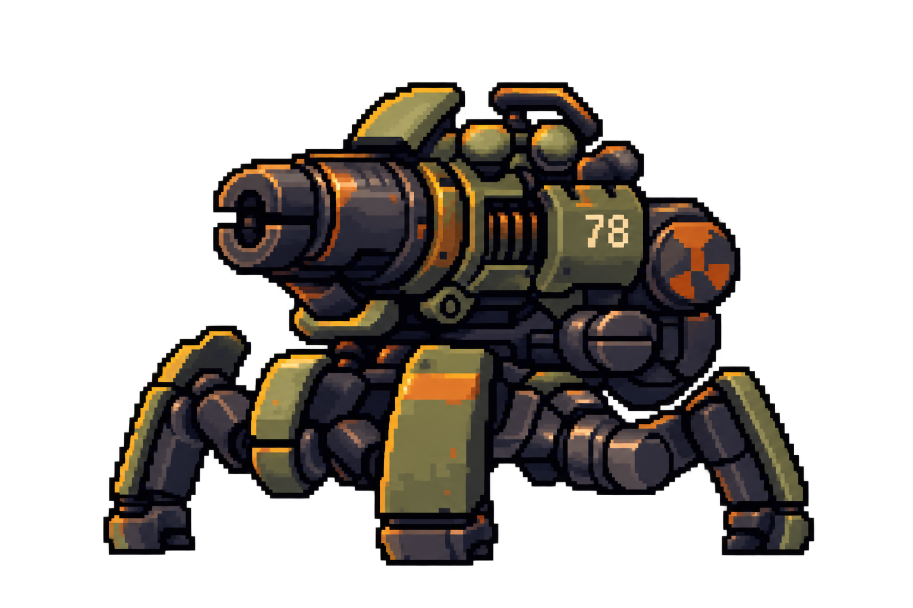
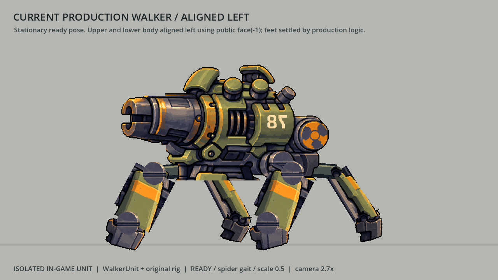

# 4족보행 로봇 — 첨부 원화와 현재 구현의 구조 비교

2026-09-22. 목적은 **첨부 원화의 카메라 시점과 보이는 부품을 보존한 컷아웃 리그를 인게임에 옮기는 것**이다. 이번 문서는 구조 분석과 분해 기준을 다룬다. 원화 기반 새 리그 구현 완료를 의미하지 않는다.

현재 구현은 첨부 원화를 그대로 분해한 것이 아니다. 별도로 그려진 측면 이미지에서 일부 조각을 추출하고, 이를 신축 다리·반복 관절·가상 깊이 투영에 맞춰 재조립했다. 외형 차이의 원인은 애니메이션 강도뿐 아니라 **입력 이미지, 관절 모델, 분할 경계, 기준 자세**에 있다.

## 비교 자료와 재현 조건

- **기준 원화:** [첨부와 동일한 저장소 원본](../Assets/Generated/QuadrupedRobotConcept/LineVariants/exec-ff57781c-c0a1-4157-a302-7f8c14c6dedc.png). 1536×1024. 첨부 `image-1.png`와 파일 바이트 및 RGBA 픽셀이 모두 일치한다. SHA256: `198caf260a0f20dd7bee454172fdbdd9be42f549548aa0657c8ac0304faebcc8`.
- **현재 절취 소스:** [quadruped_side_transparent_v1.png](../Assets/Generated/QuadrupedRobotConcept/SideViewCutout/quadruped_side_transparent_v1.png). 1204×1135. 원화와 포신·외장·연결부·하이라이트가 다르게 그려져 있다. 단순 배경 제거본이 아니다.
- **현 자산 출처 검증:** 절취 도구를 출력 없이 메모리에서 재실행하여 현재 PNG 9종과 비교했다. 모두 RGBA가 100% 일치했다. `parts.json`의 출처 표기와 실제 픽셀이 일치한다.
- **현재 모습:** 실제 `WalkerUnit` 클래스를 격리해 생성하고 기동시킨 렌더. READY, 거미 걸음, 기체 배율 0.5, 카메라 확대 2.7, 정지, 수평 조준. 게임 전체 화면이나 수정된 새 리그가 아니다. 원화와의 비교용으로 상·하체가 모두 왼쪽인 자세와 상체만 왼쪽인 실제 독립 조준 자세를 나누었다. [촬영 상태·소스 해시](References/QuadrupedRobot/capture_metadata.json).

| 첨부 원화 | 현재 인게임 기체 — 상·하체 왼쪽 정렬 |
|---|---|
|  |  |

그림의 배경·출력 해상도는 다르므로 캔버스 크기를 비례 측정의 근거로 삼지 않았다. 아래 판단은 부품 연결과 겹침, 파츠 출처, 코드의 실제 관절 계산을 비교한 것이다.

## 구조적으로 다른 부분

| 항목 | 원화에서 확인되는 형태 | 현재 구현과 차이 |
|---|---|---|
| 출처와 카메라 | 살짝 위에서 내려다보는 사선 시점. 포구 단면, 상판, 원통 윗면, 각 다리의 옆면 노출이 한 그림 안에서 정해져 있다. | 별도 측면 이미지를 사용한다. 몸통은 이미지 자체의 원근을 품고 있고 다리 위치는 가상 깊이 좌표로 계산한다. 원화 좌표로 재조립했을 때 일치해야 한다는 조건이 없다. |
| 다리 연결 방식 | 차체 아래 검은 연결부, 몸 바깥으로 꺾이는 짧은 암, 둥근 연결 하우징, 긴 장갑판과 짧은 발판이 겹쳐 보인다. | 독립된 짧은 암 없이 `고관절 → 가변 길이 직선 스트럿 → 짧은 발목·발`로 단순화했다. 긴 초록 판은 고관절에 바로 붙는 슬리브로 취급한다. |
| 무릎 위치와 운동 | 장갑판 위·옆의 굽은 연결부와 원형 구조가 다리의 접힌 실루엣을 만든다. 정확한 숨은 축은 한 장으로 확정할 수 없다. | 코드의 무릎은 발에서 50리그px 위로 정한다. 짧은 끝마디를 거의 수직으로 유지하고 나머지 거리를 스트럿 신축으로 흡수한다. 원화의 연결부를 따라 관절을 복원한 결과가 아니다. |
| 노출된 유압봉 | 길게 노출된 민무늬 직선 로드는 첨부 원화에서 확인되지 않는다. | 44×300 로드 이미지를 새로 그렸다. 최대 스트럿 300, 장갑 길이 137이므로 크게 뻗을 때 길고 가는 합성 막대가 노출될 수 있다. |
| 장갑판의 길이 | 원화에서는 테두리와 모서리를 가진 하나의 단단한 판으로 보인다. | 텍스처 자체를 늘이지는 않지만 스트럿이 짧아지면 `region_rect`로 판 아래를 잘라 보인다. 강체 판의 접힘을 재현한 동작과 다르다. |
| 관절 모양과 가림 | 관절마다 노출 방향, 하우징 모양, 장갑에 가려지는 비율이 다르다. | 가까운 캡 하나와 먼 캡 하나를 고관절·무릎에 반복하여 총 8개를 배치한다. 가까운 앞·뒤와 먼 앞·뒤 다리도 같은 조각을 공유한다. 원화의 서로 다른 연결부가 규칙적인 원판으로 바뀐다. |
| 몸통과 하체 분리 | 상부 무장 덩어리 아래에 낮고 복잡한 하부 프레임과 관절 하우징이 붙는다. | `hull` 한 장에 상부 외장과 하부 골반·관절 하우징이 함께 남는다. 이 전체가 상체를 따라 돌고, 별도 다리 관절은 하체에 남는다. |
| 부품 중복 | 한 부품의 픽셀은 해당 위치에서 한 번 보인다. | hull과 중앙 장갑판 절취 범위가 원본 높이 70px(리그 약 23.8px) 겹친다. 실제 hull 아래에 장갑판 윗부분이 남아 있고, 그 아래에 다시 움직이는 장갑판을 붙인다. 하우징 속 고정 관절 그림과 새 캡도 함께 보인다. |
| 추가 연결 프레임 | 검고 굽은 연결부가 몸통 아래에 조밀하게 겹친다. | 최근 추가한 `SuspensionBridge`는 직선 빔 네 개와 베어링을 코드로 그린다. 연결이 끊겨 보이는 현상을 덮지만 원화의 하부 구조와 다른 실루엣을 만든다. |
| 상체 회전 | 해당 시점의 외장·원통 단면·겹침이 그려진 한 장이다. | 같은 hull 이미지를 가로로 눌러 반전하고, 두께 면에도 같은 hull 복사본을 사용한다. 실제 정면·후면 자산이 없어 중간 시점의 구조는 원화에서 가져온 것이 아니다. |
| 포신과 포가 | 포신, 금색 연결부, 아래 받침, 후방 본체가 연결된 형태다. | 금색 링·관·총구를 한 조각으로 묶고 링 중심을 부앙축으로 가정했다. 몸통에서 포신을 지운 자리는 흐림과 색 혼합으로 만든 소켓이다. 원화가 실제 회전축을 확정해 주는 것은 아니다. |
| 표기·픽셀 보존 | 원화의 `78` 표기와 픽셀 테두리가 기준이다. | 소스를 좌우 반전한 뒤 `78`만 복원했으므로 다시 왼쪽을 보면 표기가 뒤집힌다. 절취 시 0.34배 LANCZOS 축소와 알파 이진화도 적용되어 원본 픽셀을 그대로 보존한 조각이 아니다. |

원화에 숨은 관절이 없다고 단정하지 않는다. **확실한 사실은 보이는 연결부를 별도 부품으로 옮기지 않았고, 현재의 신축 스트럿 구조는 코드가 선택한 해석이라는 점**이다. 코드 주석에서 초록 판을 “유압 슬리브”로 부른 사실만으로 그 해석이 원화의 구조라고 입증되지는 않는다.

최근 애니메이션 개선에 추가된 직선 브릿지와 복제 몸통의 두께 면도 원화 충실도를 높이는 해결책은 아니다. 해당 변경은 현재 리그의 연결과 회전을 성립시키는 보강이었다.

## 원화 그대로 옮기기 위한 분해 기준

먼저 **원화 기준 자세를 재조립하면 원화와 겹쳐지는 것**을 통과 조건으로 삼아야 한다. 그 뒤 보행과 조준을 붙인다. 현재 리그 수치에 맞춰 그림을 자르는 순서를 계속 쓰면 구조 차이가 유지된다.

| 분리 대상 | 보존할 것 / 결정할 것 |
|---|---|
| 하부 차체·골반 | 상체와 별도 조각으로 분리. 다리가 실제로 연결되는 하우징과 검은 하부 프레임을 함께 보존. |
| 상부 무장 본체 | `78` 외장, 후면 원형 부품, 상부 실린더와 덮개를 원화 배치 그대로 유지. 무조건 모든 장식을 개별 본으로 만들 필요는 없다. |
| 포신·포가·아래 받침 | 실제로 움직일 묶음을 정한 뒤 경계를 나눈다. 원화에서 불명확한 부앙축은 가설로 표시하고 작은 각도로 시험한다. |
| 네 다리의 근위 연결부 | 보이는 검은 짧은 암과 관절 하우징을 각각 추출. 앞·뒤를 같은 장갑판 복사로 대신하지 않는다. |
| 긴 장갑 다리 | 원화 모양과 길이를 유지하는 강체 조각. 움직이는 동안 판의 아래를 잘라 길이를 바꾸지 않는다. |
| 발목·발판 | 관절 경계를 보존. 별도 회전이 꼭 필요하지 않으면 한 묶음으로 유지할 수 있다. |
| 가까운/먼 다리 | 원화에서 보이는 폭, 기울기, 가림 순서를 그대로 보존. 가려진 네 번째 다리는 보이는 부분과 추정 복원 부분을 구분한다. |
| 가려진 면과 배경 | 원화의 검은 배경·외곽 발광을 분리한다. 움직일 때만 드러나는 숨은 부위는 최소 범위만 보완하며, 기존에 보이던 픽셀을 다시 그리지 않는다. |

각 조각은 **원화 좌표계의 위치, 피벗, 부모, 앞뒤 레이어, 기준 회전**을 함께 저장해야 한다. 피벗은 보이는 축을 우선하고 가려진 축은 추정으로 표시한다. 팔레트로 새 유압봉을 만든 뒤 그에 맞춰 관절 위치를 정하는 방식은 이 목표의 기준이 될 수 없다.

애니메이션은 고정 길이의 연결부가 회전하며 무게를 전달하도록 설계하고, 발 접지를 보조하는 IK를 그 구조에 맞춘다. 큰 탄성 표현은 우선 포즈·타이밍·관절 지연·서스펜션에서 얻는다. 금속 장갑의 크기 변화는 원화 구조 재현과 별도로 판단한다.

## 한 장으로 가능한 범위와 추가 자료가 필요한 범위

같은 카메라 시점에서 컷아웃 보행, 반동, 작은 기울기와 제한된 부앙은 이 원화를 출발점으로 만들 수 있다. 움직일 때 드러나는 가려진 면은 보완이 필요할 수 있다.

이동 방향과 조준 입력은 계속 독립시킬 수 있다. 다만 **상체가 실제로 좌우·정면·뒤쪽으로 돌아가는 모습을 한 장의 측면 그림만으로 정확히 묘사할 수는 없다.** 그 회전을 유지하려면 같은 카메라에서 본 다른 방향의 상체 자산을 추가하거나, 사용할 자세·전환 범위를 정해야 한다. 옆면 그림을 눌러 만든 가짜 정면은 “원화 구조 그대로”의 완료 기준을 충족하지 않는다.

첨부 한 장만으로 카메라의 정확한 수치, 가려진 관절 축, 네 번째 다리 전체, 완전한 후면 구조를 확정할 수 없다. 이 항목은 설계 결정 또는 추가 그림이 필요한 부분으로 남긴다.

## 다음 구현의 검수 기준

1. 원본 해상도에서 분리한 조각을 무변형으로 재조립해 기준 원화와 겹쳐 본다. 의도한 배경 제거·숨은 면 보완을 제외한 보이는 실루엣과 픽셀 위치가 일치해야 한다.
2. 기준 자세에서 차체 폭, 포신 위치, 네 발 배치, 각 장갑판 기울기, 부품 가림 순서를 확인한다. 상체·하체 방향이 다른 자세를 기준 비교에 섞지 않는다.
3. 각 본을 작은 각도로 움직여 중복 픽셀, 관절 틈, 잘린 판, 원래 하우징에 남은 가짜 관절이 없는지 검사한다.
4. 고정 길이와 피벗을 유지한 채 걷기·후진·착지·조준을 연결한다. 원화에 없는 긴 노출 로드와 직선 연결 프레임이 다시 생기지 않아야 한다.
5. 실제 `WalkerUnit` 0.5배와 게임 카메라에서 확인한다. 기존 보행·사격 테스트는 유지하되, 원화 정합 검사를 별도로 추가한다. 기존 테스트 통과만으로 원화 구조의 충실도를 증명할 수 없다.

## 구현 근거 위치

- 절취 소스: `Tools/ImageProcessing/cut_quadruped_rig_parts.py:46`, `GodotPrototype/assets/quadruped/parts.json:2`.
- 좌우 반전·데칼 복원: 절취 도구 `load_source()`; 축소는 `cut()`의 `Image.LANCZOS`.
- hull/장갑 겹치는 절취 범위: 절취 도구 `PARTS`, hull `(19,12,954,660)`, sleeve `(588,590,836,992)`.
- 새 유압봉: 절취 도구 `make_rod()`, `parts.json`의 `rod.synthesized`.
- 관절 상수: `GodotPrototype/scripts/proc_walker.gd:52`의 `SHIN_LEN=50`, `THIGH_MAX=300`, `SLEEVE_LEN=137`.
- 무릎 계산: 같은 파일 `:964`의 `_knee_at()` 및 `:979`의 `solve_knee_v()`.
- 관절 반복: `GodotPrototype/scripts/walker_rig.gd:53`의 `CAP_ALIAS` 및 `:298`의 `_sync_leg()`.
- 장갑판 잘림: 같은 파일 `:349`의 `_fit()`.
- 추가 차체 연결부: 같은 파일 `:244`의 `_draw_chassis()`.
- 옆면 재사용 회전: 같은 파일 `:118`의 `_turn_face` 생성, `:260`의 `_sync_body()`.
- 본편 공용 사용: `GodotPrototype/scripts/walker_unit.gd:118`의 `_build()`, `:32`의 `SCALE=0.5`.
